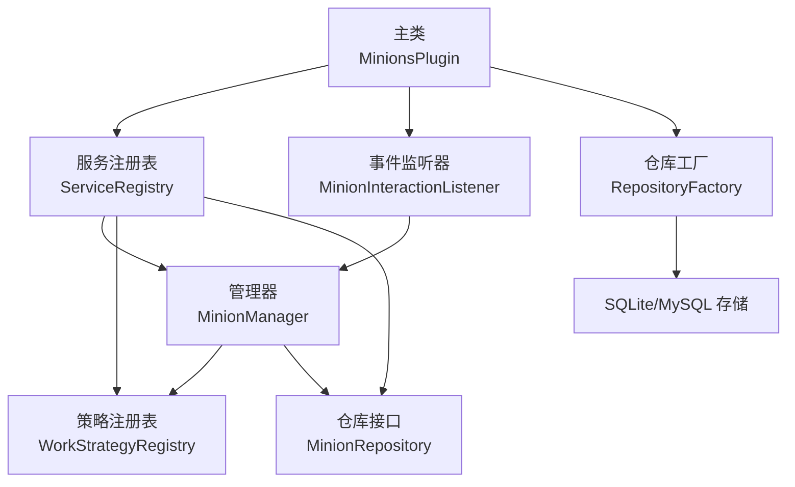
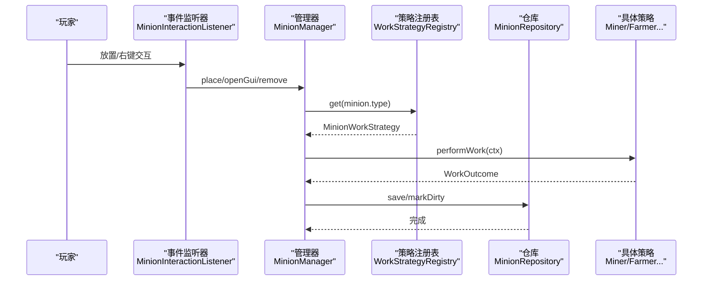
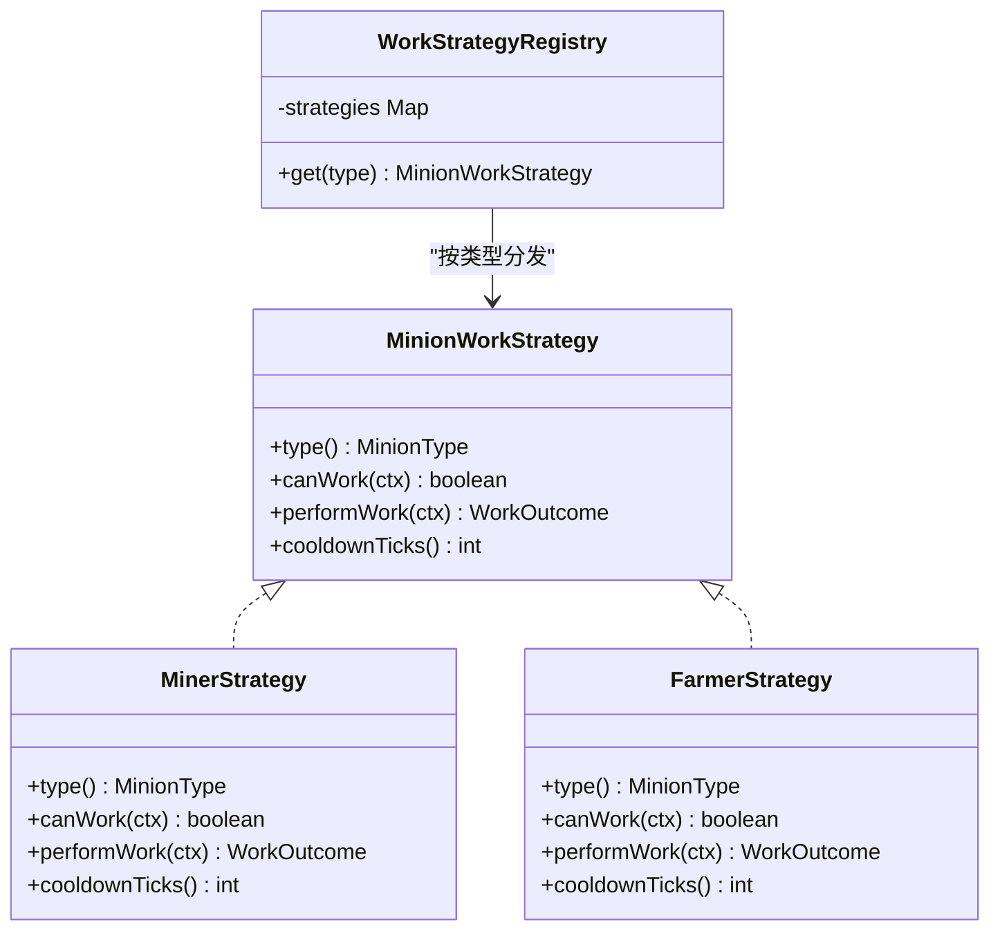
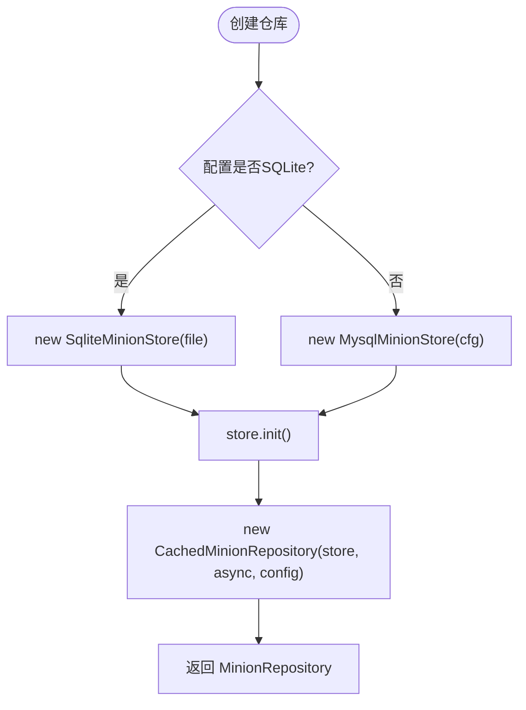
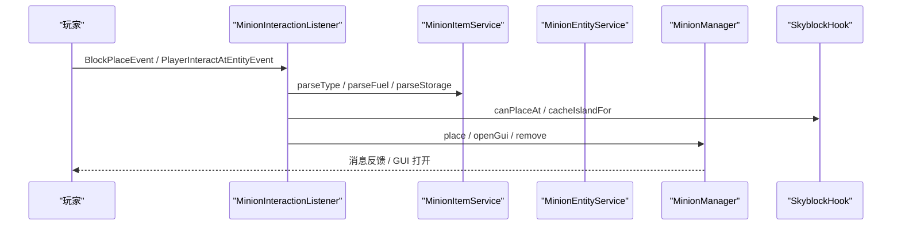
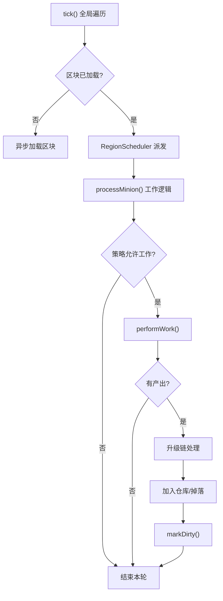
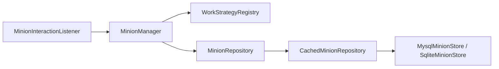

# 设计模式应用

<cite>
**本文引用的文件**
- [MinionsPlugin.java](file://src/main/java/com/hcs/minions/MinionsPlugin.java)
- [ServiceRegistry.java](file://src/main/java/com/hcs/minions/core/ServiceRegistry.java)
- [WorkStrategyRegistry.java](file://src/main/java/com/hcs/minions/work/WorkStrategyRegistry.java)
- [MinionWorkStrategy.java](file://src/main/java/com/hcs/minions/work/MinionWorkStrategy.java)
- [MinerStrategy.java](file://src/main/java/com/hcs/minions/work/miner/MinerStrategy.java)
- [FarmerStrategy.java](file://src/main/java/com/hcs/minions/work/farmer/FarmerStrategy.java)
- [RepositoryFactory.java](file://src/main/java/com/hcs/minions/repository/RepositoryFactory.java)
- [MinionRepository.java](file://src/main/java/com/hcs/minions/repository/MinionRepository.java)
- [CachedMinionRepository.java](file://src/main/java/com/hcs/minions/repository/CachedMinionRepository.java)
- [MysqlMinionStore.java](file://src/main/java/com/hcs/minions/repository/mysql/MysqlMinionStore.java)
- [SqliteMinionStore.java](file://src/main/java/com/hcs/minions/repository/sqlite/SqliteMinionStore.java)
- [MinionInteractionListener.java](file://src/main/java/com/hcs/minions/listener/MinionInteractionListener.java)
- [MinionManager.java](file://src/main/java/com/hcs/minions/service/MinionManager.java)
- [MinionType.java](file://src/main/java/com/hcs/minions/model/MinionType.java)
</cite>

## 目录
1. [简介](#简介)
2. [项目结构](#项目结构)
3. [核心组件](#核心组件)
4. [架构总览](#架构总览)
5. [详细组件分析](#详细组件分析)
6. [依赖关系分析](#依赖关系分析)
7. [性能考量](#性能考量)
8. [故障排查指南](#故障排查指南)
9. [结论](#结论)

## 简介
本插件围绕“仆从自动化工作”这一核心玩法，采用多种经典设计模式实现高内聚、低耦合的架构：
- 策略模式：通过 WorkStrategyRegistry 管理不同仆从的工作策略（矿工、农夫、伐木工等），新增类型无需修改调度逻辑。
- 工厂模式：RepositoryFactory 根据配置创建 SQLite 或 MySQL 存储实现，统一对外暴露 MinionRepository 接口。
- 单例模式：ServiceRegistry 作为全局服务容器，在插件生命周期中装配一次后全局只读共享。
- 观察者模式：Bukkit 事件监听器处理玩家放置与交互等事件，解耦 UI/权限/世界钩子等业务细节。

这些模式共同支撑了可插拔、可扩展、易维护的系统结构，使业务层仅面向接口编程，屏蔽底层差异，提升扩展性与可测试性。

## 项目结构
- 入口与装配：主类负责加载配置、初始化异步执行器、装配服务、注册事件与命令、启动调度任务。
- 服务层：管理器协调工作循环、实体生成、掉落处理、售卖与升级模块。
- 数据访问层：仓库抽象 + 缓存 + 具体存储（SQLite/MySQL）。
- 策略层：按仆从类型定义工作策略，由注册表分发。
- 事件层：监听玩家行为，触发放置、交互、GUI 等流程。

图表来源
- [MinionsPlugin.java:50-118](file://src/main/java/com/hcs/minions/MinionsPlugin.java#L50-L118)
- [ServiceRegistry.java:21-149](file://src/main/java/com/hcs/minions/core/ServiceRegistry.java#L21-L149)
- [RepositoryFactory.java:15-30](file://src/main/java/com/hcs/minions/repository/RepositoryFactory.java#L15-L30)
- [MinionManager.java:44-86](file://src/main/java/com/hcs/minions/service/MinionManager.java#L44-L86)

章节来源
- [MinionsPlugin.java:50-118](file://src/main/java/com/hcs/minions/MinionsPlugin.java#L50-L118)

## 核心组件
- 策略模式
  - 接口与实现：MinionWorkStrategy 定义 canWork/performWork/cooldownTicks；各类型策略（如 MinerStrategy、FarmerStrategy）实现具体工作逻辑。
  - 注册与分发：WorkStrategyRegistry 以枚举为键维护策略映射，get(type) 返回对应策略，避免 if-else 分支。
- 工厂模式
  - RepositoryFactory.create 依据 DatabaseConfig 选择 SQLite 或 MySQL 存储，并包装为带缓存的 CachedMinionRepository。
  - 业务层仅依赖 MinionRepository 接口，对底层 IO 无感知。
- 单例模式
  - ServiceRegistry 集中持有所有服务实例，主类 onEnable 中按依赖顺序装配一次，后续通过 getter 获取，保证全局唯一且线程安全读取。
- 观察者模式
  - MinionInteractionListener 监听放置与交互事件，结合权限、世界钩子与服务层完成放置、拾取、补燃料、打开 GUI 等行为。

章节来源
- [MinionWorkStrategy.java:1-27](file://src/main/java/com/hcs/minions/work/MinionWorkStrategy.java#L1-L27)
- [WorkStrategyRegistry.java:10-33](file://src/main/java/com/hcs/minions/work/WorkStrategyRegistry.java#L10-L33)
- [MinerStrategy.java:15-57](file://src/main/java/com/hcs/minions/work/miner/MinerStrategy.java#L15-L57)
- [FarmerStrategy.java:17-71](file://src/main/java/com/hcs/minions/work/farmer/FarmerStrategy.java#L17-L71)
- [RepositoryFactory.java:11-30](file://src/main/java/com/hcs/minions/repository/RepositoryFactory.java#L11-L30)
- [MinionRepository.java:11-48](file://src/main/java/com/hcs/minions/repository/MinionRepository.java#L11-L48)
- [ServiceRegistry.java:18-149](file://src/main/java/com/hcs/minions/core/ServiceRegistry.java#L18-L149)
- [MinionInteractionListener.java:31-157](file://src/main/java/com/hcs/minions/listener/MinionInteractionListener.java#L31-L157)

## 架构总览
系统以 ServiceRegistry 为中心进行服务装配，MinionManager 作为核心调度器驱动工作循环，策略注册表按类型分发工作策略，仓库层提供跨实现的持久化能力，事件监听器将玩家行为转化为服务调用。

图表来源
- [MinionInteractionListener.java:54-142](file://src/main/java/com/hcs/minions/listener/MinionInteractionListener.java#L54-L142)
- [MinionManager.java:252-322](file://src/main/java/com/hcs/minions/service/MinionManager.java#L252-L322)
- [WorkStrategyRegistry.java:18-32](file://src/main/java/com/hcs/minions/work/WorkStrategyRegistry.java#L18-L32)
- [MinionRepository.java:18-43](file://src/main/java/com/hcs/minions/repository/MinionRepository.java#L18-L43)

## 详细组件分析

### 策略模式：WorkStrategyRegistry 与各工作策略
- 设计要点
  - 接口隔离：MinionWorkStrategy 仅暴露类型判定、工作执行与冷却时间三个方法，职责单一。
  - 注册表分发：WorkStrategyRegistry 使用 EnumMap 维护类型到策略的映射，get(type) 未命中时抛出明确异常，便于快速定位配置问题。
  - 开闭原则：新增仆从类型只需新增策略实现并在主类中注册，无需改动调度逻辑。
- 复杂度与性能
  - 查找 O(1)，EnumMap 键为枚举避免装箱开销。
  - 策略内部搜索由 BlockSearcher 限流，避免全图扫描。
- 协作关系
  - MinionManager 在每个 tick 委派到对应策略执行工作，结果进入升级链与掉落处理。

图表来源
- [MinionWorkStrategy.java:1-27](file://src/main/java/com/hcs/minions/work/MinionWorkStrategy.java#L1-L27)
- [MinerStrategy.java:15-57](file://src/main/java/com/hcs/minions/work/miner/MinerStrategy.java#L15-L57)
- [FarmerStrategy.java:17-71](file://src/main/java/com/hcs/minions/work/farmer/FarmerStrategy.java#L17-L71)
- [WorkStrategyRegistry.java:10-33](file://src/main/java/com/hcs/minions/work/WorkStrategyRegistry.java#L10-L33)

章节来源
- [MinionWorkStrategy.java:1-27](file://src/main/java/com/hcs/minions/work/MinionWorkStrategy.java#L1-L27)
- [WorkStrategyRegistry.java:10-33](file://src/main/java/com/hcs/minions/work/WorkStrategyRegistry.java#L10-L33)
- [MinerStrategy.java:15-57](file://src/main/java/com/hcs/minions/work/miner/MinerStrategy.java#L15-L57)
- [FarmerStrategy.java:17-71](file://src/main/java/com/hcs/minions/work/farmer/FarmerStrategy.java#L17-L71)

### 工厂模式：RepositoryFactory 与存储实现
- 设计要点
  - 工厂方法 create(cfg, async, pluginConfig, dataFolder) 根据配置选择 SQLite 或 MySQL Store，并包装为带缓存的 CachedMinionRepository。
  - 业务层仅依赖 MinionRepository 接口，屏蔽数据库差异与缓存细节。
- 数据一致性
  - 写穿缓存：save 先入内存缓存并标记脏集合，周期批量落库。
  - 两阶段落库：collectDirtyIds 收集 ID，region 线程生成快照后 flushSnapshots 异步写入，避免 Inventory 并发访问。
- 性能特性
  - 内存缓存 ConcurrentHashMap 提供 O(1) 读取。
  - 虚拟线程异步执行 SQL，主线程零阻塞。

图表来源
- [RepositoryFactory.java:15-30](file://src/main/java/com/hcs/minions/repository/RepositoryFactory.java#L15-L30)
- [CachedMinionRepository.java:19-80](file://src/main/java/com/hcs/minions/repository/CachedMinionRepository.java#L19-L80)
- [MysqlMinionStore.java:64-92](file://src/main/java/com/hcs/minions/repository/mysql/MysqlMinionStore.java#L64-L92)
- [SqliteMinionStore.java:62-79](file://src/main/java/com/hcs/minions/repository/sqlite/SqliteMinionStore.java#L62-L79)

章节来源
- [RepositoryFactory.java:15-30](file://src/main/java/com/hcs/minions/repository/RepositoryFactory.java#L15-L30)
- [MinionRepository.java:11-48](file://src/main/java/com/hcs/minions/repository/MinionRepository.java#L11-L48)
- [CachedMinionRepository.java:19-215](file://src/main/java/com/hcs/minions/repository/CachedMinionRepository.java#L19-L215)
- [MysqlMinionStore.java:19-239](file://src/main/java/com/hcs/minions/repository/mysql/MysqlMinionStore.java#L19-L239)
- [SqliteMinionStore.java:18-218](file://src/main/java/com/hcs/minions/repository/sqlite/SqliteMinionStore.java#L18-L218)

### 单例模式：ServiceRegistry 作为全局服务容器
- 设计要点
  - 主类 onEnable 中按依赖顺序设置各项服务，之后通过 getter 获取，保证全局唯一且只读共享。
  - 字段均为私有并提供 setter/getter，装配期赋值，运行期稳定。
- 优势
  - 降低耦合：组件间通过 ServiceRegistry 获取依赖，避免构造函数层层传递。
  - 易于测试：可在测试中替换部分服务为 Mock。

章节来源
- [ServiceRegistry.java:18-149](file://src/main/java/com/hcs/minions/core/ServiceRegistry.java#L18-L149)
- [MinionsPlugin.java:50-118](file://src/main/java/com/hcs/minions/MinionsPlugin.java#L50-L118)

### 观察者模式：Bukkit 事件监听器处理用户交互
- 设计要点
  - 监听放置事件：解析物品中的仆从类型、检查权限与世界钩子，构造 Minion 并交由管理器放置。
  - 监听实体交互：识别盔甲架关联的仆从，支持潜行拾取、手持燃料补给、打开 GUI。
- 优势
  - 事件驱动解耦：UI/权限/世界限制等横切关注点集中在监听器中，不影响核心业务。
  - 可扩展：新增交互行为只需添加新监听或扩展现有监听逻辑。

图表来源
- [MinionInteractionListener.java:54-142](file://src/main/java/com/hcs/minions/listener/MinionInteractionListener.java#L54-L142)
- [MinionManager.java:356-390](file://src/main/java/com/hcs/minions/service/MinionManager.java#L356-L390)

章节来源
- [MinionInteractionListener.java:31-157](file://src/main/java/com/hcs/minions/listener/MinionInteractionListener.java#L31-L157)

### 复杂逻辑流程：工作循环与落库
- 工作循环
  - 全局遍历仅做纯内存判断，真正触碰方块/实体的操作委派到 region 线程执行，确保 Folia 兼容。
  - 通过策略注册表获取策略，执行 canWork/performWork，计算冷却并安排下次工作。
- 落库流程
  - 定期收集脏 ID，在各自 region 线程生成快照，再异步批量写入，避免 Inventory 并发访问导致的数据不一致。

图表来源
- [MinionManager.java:191-322](file://src/main/java/com/hcs/minions/service/MinionManager.java#L191-L322)
- [CachedMinionRepository.java:100-171](file://src/main/java/com/hcs/minions/repository/CachedMinionRepository.java#L100-L171)

章节来源
- [MinionManager.java:191-322](file://src/main/java/com/hcs/minions/service/MinionManager.java#L191-L322)
- [CachedMinionRepository.java:100-171](file://src/main/java/com/hcs/minions/repository/CachedMinionRepository.java#L100-L171)

## 依赖关系分析
- 松耦合
  - 业务层依赖接口（MinionRepository、MinionWorkStrategy），不关心具体实现。
  - 事件监听器通过 ServiceRegistry 注入的服务协作，避免直接耦合。
- 内聚性
  - 每个策略专注一种工作类型；存储实现专注特定数据库；管理器专注编排与调度。
- 潜在风险
  - 若新增类型未在注册表中注册，get(type) 会抛异常，需确保配置与注册一致。
  - 区域线程与全局线程边界必须严格遵守，避免在非区域线程访问 Inventory。

图表来源
- [MinionManager.java:44-86](file://src/main/java/com/hcs/minions/service/MinionManager.java#L44-L86)
- [WorkStrategyRegistry.java:10-33](file://src/main/java/com/hcs/minions/work/WorkStrategyRegistry.java#L10-L33)
- [MinionRepository.java:11-48](file://src/main/java/com/hcs/minions/repository/MinionRepository.java#L11-L48)
- [CachedMinionRepository.java:19-80](file://src/main/java/com/hcs/minions/repository/CachedMinionRepository.java#L19-L80)
- [MysqlMinionStore.java:19-92](file://src/main/java/com/hcs/minions/repository/mysql/MysqlMinionStore.java#L19-L92)
- [SqliteMinionStore.java:18-79](file://src/main/java/com/hcs/minions/repository/sqlite/SqliteMinionStore.java#L18-L79)
- [MinionInteractionListener.java:31-157](file://src/main/java/com/hcs/minions/listener/MinionInteractionListener.java#L31-L157)

章节来源
- [MinionManager.java:44-86](file://src/main/java/com/hcs/minions/service/MinionManager.java#L44-L86)
- [MinionInteractionListener.java:31-157](file://src/main/java/com/hcs/minions/listener/MinionInteractionListener.java#L31-L157)

## 性能考量
- 策略查找：EnumMap 键为枚举，避免装箱，O(1) 查找。
- 数据访问：ConcurrentHashMap 缓存热点数据；异步执行 SQL，主线程零阻塞。
- 线程模型：GlobalRegionScheduler 仅做轻量判断，区域绑定操作委派到 RegionScheduler，保障 Folia 兼容与线程安全。
- 批量落库：两阶段收集+快照+批量写入，减少锁竞争与 IO 次数。
- 连接池：MySQL 使用 HikariCP，控制池大小与超时，避免虚拟线程固定载体导致的资源膨胀。

[本节为通用性能讨论，不直接分析具体文件]

## 故障排查指南
- 未注册策略异常
  - 现象：get(type) 抛出未注册异常。
  - 排查：确认配置中存在该类型，且主类已将其策略加入列表并构建注册表。
- 数据丢失或中间态
  - 现象：关闭时出现落库失败或读到不一致 Inventory。
  - 排查：确保 stop() 路径先关闭 GUI，再同步冲刷脏数据；避免在异步线程直接访问 Inventory。
- 区域线程违规
  - 现象：Folia 下出现非法线程访问错误。
  - 排查：确保所有涉及方块/实体/Inventory 的操作在 RegionScheduler 中执行。
- 数据库迁移失败
  - 现象：旧库缺少列导致异常。
  - 排查：检查 init/migrate 是否成功执行，确认驱动加载与索引创建。

章节来源
- [WorkStrategyRegistry.java:26-32](file://src/main/java/com/hcs/minions/work/WorkStrategyRegistry.java#L26-L32)
- [CachedMinionRepository.java:183-215](file://src/main/java/com/hcs/minions/repository/CachedMinionRepository.java#L183-L215)
- [MinionManager.java:162-180](file://src/main/java/com/hcs/minions/service/MinionManager.java#L162-L180)
- [MysqlMinionStore.java:64-92](file://src/main/java/com/hcs/minions/repository/mysql/MysqlMinionStore.java#L64-L92)
- [SqliteMinionStore.java:62-79](file://src/main/java/com/hcs/minions/repository/sqlite/SqliteMinionStore.java#L62-L79)

## 结论
本项目通过策略模式、工厂模式、单例模式与观察者模式的组合，实现了高内聚、低耦合的可扩展架构：
- 策略模式使工作逻辑按类型解耦，新增类型无需改动调度器。
- 工厂模式屏蔽存储差异，业务层仅依赖接口。
- 单例模式集中管理服务装配，简化依赖传递。
- 观察者模式将用户交互与业务逻辑解耦，便于扩展与维护。

这些模式协同工作，提升了系统的可维护性与扩展性，同时保证了在高并发与多版本环境下的稳定性与性能。