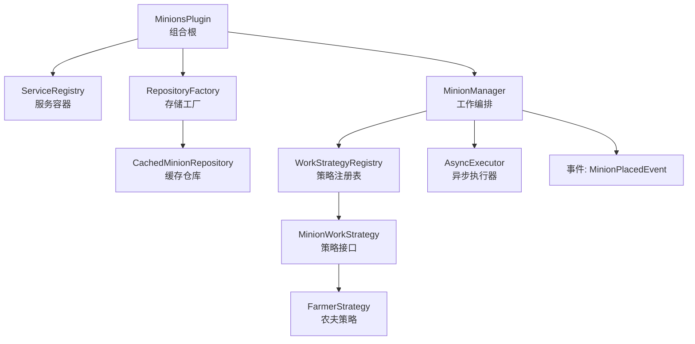
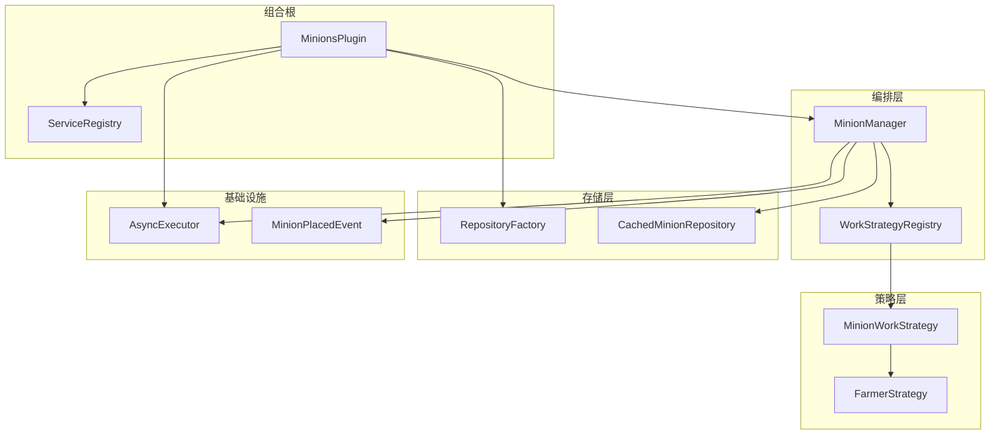
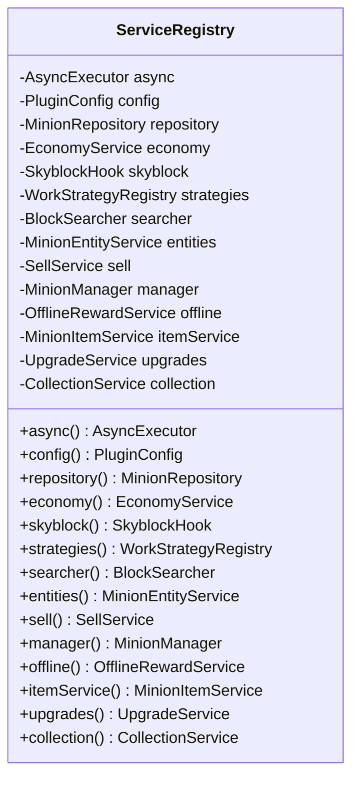
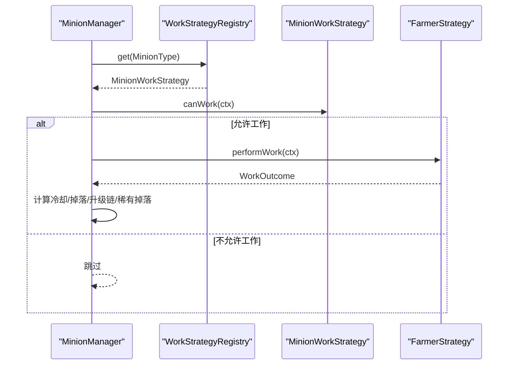
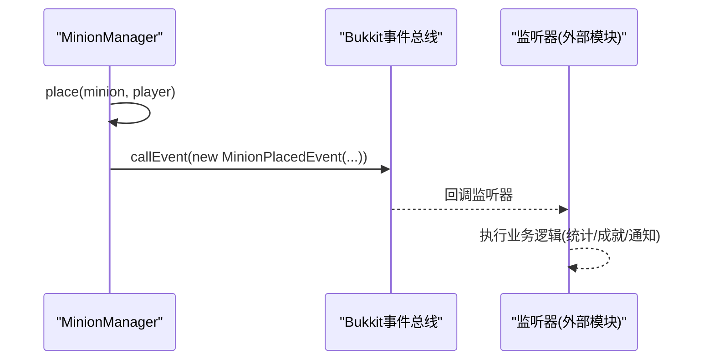
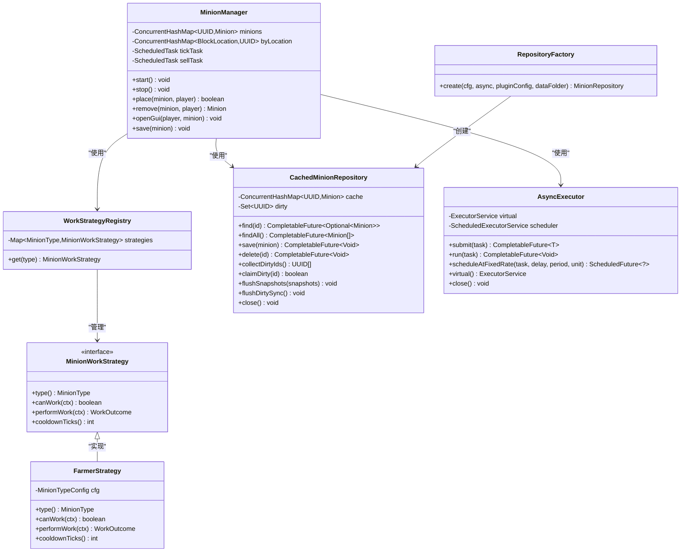
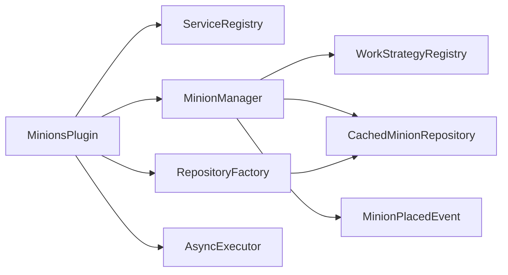
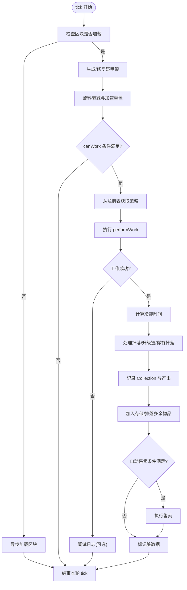

# 核心架构设计

<cite>
**本文引用的文件**
- [MinionsPlugin.java](file://src/main/java/com/hcs/minions/MinionsPlugin.java)
- [ServiceRegistry.java](file://src/main/java/com/hcs/minions/core/ServiceRegistry.java)
- [MinionManager.java](file://src/main/java/com/hcs/minions/service/MinionManager.java)
- [WorkStrategyRegistry.java](file://src/main/java/com/hcs/minions/work/WorkStrategyRegistry.java)
- [MinionWorkStrategy.java](file://src/main/java/com/hcs/minions/work/MinionWorkStrategy.java)
- [FarmerStrategy.java](file://src/main/java/com/hcs/minions/work/farmer/FarmerStrategy.java)
- [RepositoryFactory.java](file://src/main/java/com/hcs/minions/repository/RepositoryFactory.java)
- [CachedMinionRepository.java](file://src/main/java/com/hcs/minions/repository/CachedMinionRepository.java)
- [AsyncExecutor.java](file://src/main/java/com/hcs/minions/util/AsyncExecutor.java)
- [MinionPlacedEvent.java](file://src/main/java/com/hcs/minions/event/MinionPlacedEvent.java)
</cite>

## 目录
1. [简介](#简介)
2. [项目结构](#项目结构)
3. [核心组件](#核心组件)
4. [架构总览](#架构总览)
5. [详细组件分析](#详细组件分析)
6. [依赖关系分析](#依赖关系分析)
7. [性能考量](#性能考量)
8. [故障排查指南](#故障排查指南)
9. [结论](#结论)
10. [附录](#附录)

## 简介
本文件面向 SkyMinions 插件的核心架构，聚焦以下目标：
- 服务注册表模式（ServiceRegistry）的实现与应用
- 分层架构的组织方式与职责边界
- 依赖注入机制的设计与装配流程
- 策略模式在工作系统中的实现
- 观察者模式在事件处理中的应用
- 工厂模式在数据存储层的使用
- 调度器、内存管理与并发处理的性能优化策略
- 通过架构图与数据流图帮助开发者理解系统整体设计与数据流向

## 项目结构
SkyMinions 采用“组合根 + 服务容器 + 领域服务 + 基础设施”的分层组织：
- 组合根：MinionsPlugin，负责生命周期管理与服务装配
- 服务容器：ServiceRegistry，全局只读共享的服务访问点
- 业务编排：MinionManager，统一调度工作循环、落库、售卖等
- 策略层：MinionWorkStrategy 及具体策略（如 FarmerStrategy），由 WorkStrategyRegistry 管理
- 存储层：RepositoryFactory 创建 MinionStore，CachedMinionRepository 提供缓存与批量落库
- 异步执行：AsyncExecutor 封装虚拟线程池与周期调度
- 事件：自定义 Bukkit Event（如 MinionPlacedEvent）用于模块解耦

图表来源
- [MinionsPlugin.java:47-118](file://src/main/java/com/hcs/minions/MinionsPlugin.java#L47-L118)
- [ServiceRegistry.java:18-149](file://src/main/java/com/hcs/minions/core/ServiceRegistry.java#L18-L149)
- [MinionManager.java:44-115](file://src/main/java/com/hcs/minions/service/MinionManager.java#L44-L115)
- [WorkStrategyRegistry.java:10-33](file://src/main/java/com/hcs/minions/work/WorkStrategyRegistry.java#L10-L33)
- [MinionWorkStrategy.java:5-26](file://src/main/java/com/hcs/minions/work/MinionWorkStrategy.java#L5-L26)
- [FarmerStrategy.java:17-70](file://src/main/java/com/hcs/minions/work/farmer/FarmerStrategy.java#L17-L70)
- [RepositoryFactory.java:11-30](file://src/main/java/com/hcs/minions/repository/RepositoryFactory.java#L11-L30)
- [CachedMinionRepository.java:19-215](file://src/main/java/com/hcs/minions/repository/CachedMinionRepository.java#L19-L215)
- [AsyncExecutor.java:12-80](file://src/main/java/com/hcs/minions/util/AsyncExecutor.java#L12-L80)
- [MinionPlacedEvent.java:9-39](file://src/main/java/com/hcs/minions/event/MinionPlacedEvent.java#L9-L39)

章节来源
- [MinionsPlugin.java:47-118](file://src/main/java/com/hcs/minions/MinionsPlugin.java#L47-L118)
- [ServiceRegistry.java:18-149](file://src/main/java/com/hcs/minions/core/ServiceRegistry.java#L18-L149)

## 核心组件
- MinionsPlugin（组合根）
  - 职责：加载配置、创建并装配所有服务、注册监听器与命令、启动调度器与定时任务、关闭时释放资源
  - 关键行为：按依赖顺序将服务写入 ServiceRegistry；构建策略集合并注册到 WorkStrategyRegistry；启动 MinionManager 的全局 tick 与自动售卖轮询；定期保存 Collection
- ServiceRegistry（服务容器）
  - 职责：集中持有全局可访问的服务实例（配置、存储、经济、实体、售卖、权限、升级、收集、异步执行器等）
  - 特点：构造期一次性装配，运行期只读共享，避免全局状态分散
- MinionManager（工作编排）
  - 职责：加载仆从、全局 tick 遍历、区域线程委派工作逻辑、生成盔甲架实体、燃料衰减、冷却计算、掉落处理、升级链、稀有掉落、Collection 累计、自动售卖触发、脏数据快照与落库
  - 关键特性：严格区分 GlobalRegionScheduler 与 RegionScheduler 的调用边界，确保 Folia 兼容
- WorkStrategyRegistry（策略注册表）
  - 职责：维护类型到策略的只读映射（EnumMap），提供 get(type) 查找，未注册则抛异常
- MinionWorkStrategy（策略接口）
  - 职责：定义 canWork、performWork、cooldownTicks 等能力，具体策略实现不同工作语义
- RepositoryFactory（存储工厂）
  - 职责：根据数据库配置选择 SQLite 或 MySQL 实现，并包装为带缓存的 CachedMinionRepository
- CachedMinionRepository（缓存仓库）
  - 职责：内存缓存、脏标记集合、两阶段落库（collectDirtyIds -> region 线程生成快照 -> flushSnapshots）、主线程同步冲刷兜底
- AsyncExecutor（异步执行器）
  - 职责：基于 Java 21 虚拟线程的任务提交与周期调度，隔离 IO 与主线程操作
- MinionPlacedEvent（放置事件）
  - 职责：作为模块间解耦的桥梁，通知其他模块仆从已放置

章节来源
- [MinionsPlugin.java:47-118](file://src/main/java/com/hcs/minions/MinionsPlugin.java#L47-L118)
- [ServiceRegistry.java:18-149](file://src/main/java/com/hcs/minions/core/ServiceRegistry.java#L18-L149)
- [MinionManager.java:44-115](file://src/main/java/com/hcs/minions/service/MinionManager.java#L44-L115)
- [WorkStrategyRegistry.java:10-33](file://src/main/java/com/hcs/minions/work/WorkStrategyRegistry.java#L10-L33)
- [MinionWorkStrategy.java:5-26](file://src/main/java/com/hcs/minions/work/MinionWorkStrategy.java#L5-L26)
- [RepositoryFactory.java:11-30](file://src/main/java/com/hcs/minions/repository/RepositoryFactory.java#L11-L30)
- [CachedMinionRepository.java:19-215](file://src/main/java/com/hcs/minions/repository/CachedMinionRepository.java#L19-L215)
- [AsyncExecutor.java:12-80](file://src/main/java/com/hcs/minions/util/AsyncExecutor.java#L12-L80)
- [MinionPlacedEvent.java:9-39](file://src/main/java/com/hcs/minions/event/MinionPlacedEvent.java#L9-L39)

## 架构总览
SkyMinions 采用分层与模式结合的设计：
- 组合根（MinionsPlugin）负责装配与服务生命周期管理
- 服务容器（ServiceRegistry）提供全局只读访问点
- 工作编排（MinionManager）协调策略、实体、存储、异步执行与事件
- 策略层（MinionWorkStrategy + Registry）实现开闭原则，新增类型无需修改调度逻辑
- 存储层（RepositoryFactory + CachedMinionRepository）屏蔽底层差异并提供高性能缓存与批量落库
- 异步执行（AsyncExecutor）统一 IO 与调度，保证主线程不被阻塞

图表来源
- [MinionsPlugin.java:47-118](file://src/main/java/com/hcs/minions/MinionsPlugin.java#L47-L118)
- [ServiceRegistry.java:18-149](file://src/main/java/com/hcs/minions/core/ServiceRegistry.java#L18-L149)
- [MinionManager.java:44-115](file://src/main/java/com/hcs/minions/service/MinionManager.java#L44-L115)
- [WorkStrategyRegistry.java:10-33](file://src/main/java/com/hcs/minions/work/WorkStrategyRegistry.java#L10-L33)
- [MinionWorkStrategy.java:5-26](file://src/main/java/com/hcs/minions/work/MinionWorkStrategy.java#L5-L26)
- [FarmerStrategy.java:17-70](file://src/main/java/com/hcs/minions/work/farmer/FarmerStrategy.java#L17-L70)
- [RepositoryFactory.java:11-30](file://src/main/java/com/hcs/minions/repository/RepositoryFactory.java#L11-L30)
- [CachedMinionRepository.java:19-215](file://src/main/java/com/hcs/minions/repository/CachedMinionRepository.java#L19-L215)
- [AsyncExecutor.java:12-80](file://src/main/java/com/hcs/minions/util/AsyncExecutor.java#L12-L80)
- [MinionPlacedEvent.java:9-39](file://src/main/java/com/hcs/minions/event/MinionPlacedEvent.java#L9-L39)

## 详细组件分析

### 服务注册表模式（ServiceRegistry）
- 设计要点
  - 单一入口：所有服务在 onEnable 中按依赖顺序装配后，通过 ServiceRegistry 暴露只读访问
  - 强类型字段：每个服务对应一个明确字段与 getter/setter，便于 IDE 提示与编译期检查
  - 生命周期绑定：onDisable 中通过 registry 获取服务进行有序关闭
- 使用场景
  - MinionsPlugin 在 onEnable 中依次设置配置、异步执行器、存储、策略、实体、售卖、权限、升级、收集、管理器、离线奖励、物品服务等
  - 各组件通过 ServiceRegistry 获取所需服务，避免硬编码 new 与全局单例散落

图表来源
- [ServiceRegistry.java:18-149](file://src/main/java/com/hcs/minions/core/ServiceRegistry.java#L18-L149)

章节来源
- [MinionsPlugin.java:47-118](file://src/main/java/com/hcs/minions/MinionsPlugin.java#L47-L118)
- [ServiceRegistry.java:18-149](file://src/main/java/com/hcs/minions/core/ServiceRegistry.java#L18-L149)

### 分层架构与依赖注入
- 分层
  - 组合根层：MinionsPlugin
  - 编排层：MinionManager
  - 策略层：MinionWorkStrategy 及其实现
  - 存储层：RepositoryFactory + CachedMinionRepository
  - 基础设施：AsyncExecutor、事件
- 依赖注入
  - 显式构造注入：MinionManager 构造函数接收所有依赖，便于测试与替换
  - 工厂注入：RepositoryFactory 根据配置返回具体存储实现
  - 注册表注入：WorkStrategyRegistry 集中管理策略实例

章节来源
- [MinionsPlugin.java:47-118](file://src/main/java/com/hcs/minions/MinionsPlugin.java#L47-L118)
- [MinionManager.java:70-86](file://src/main/java/com/hcs/minions/service/MinionManager.java#L70-L86)
- [RepositoryFactory.java:11-30](file://src/main/java/com/hcs/minions/repository/RepositoryFactory.java#L11-L30)
- [WorkStrategyRegistry.java:10-33](file://src/main/java/com/hcs/minions/work/WorkStrategyRegistry.java#L10-L33)

### 策略模式在工作系统中的实现
- 接口与注册表
  - MinionWorkStrategy 定义工作语义（canWork、performWork、cooldownTicks）
  - WorkStrategyRegistry 以 EnumMap 维护类型到策略的映射，get(type) 提供 O(1) 查找
- 具体策略示例
  - FarmerStrategy：搜索成熟作物，破坏并补种，统计掉落与经验
- 调度流程
  - MinionManager 在 tick 中根据 MinionType 从 WorkStrategyRegistry 取策略，委托其执行工作

图表来源
- [MinionManager.java:252-322](file://src/main/java/com/hcs/minions/service/MinionManager.java#L252-L322)
- [WorkStrategyRegistry.java:10-33](file://src/main/java/com/hcs/minions/work/WorkStrategyRegistry.java#L10-L33)
- [MinionWorkStrategy.java:5-26](file://src/main/java/com/hcs/minions/work/MinionWorkStrategy.java#L5-L26)
- [FarmerStrategy.java:17-70](file://src/main/java/com/hcs/minions/work/farmer/FarmerStrategy.java#L17-L70)

章节来源
- [MinionManager.java:252-322](file://src/main/java/com/hcs/minions/service/MinionManager.java#L252-L322)
- [WorkStrategyRegistry.java:10-33](file://src/main/java/com/hcs/minions/work/WorkStrategyRegistry.java#L10-L33)
- [MinionWorkStrategy.java:5-26](file://src/main/java/com/hcs/minions/work/MinionWorkStrategy.java#L5-L26)
- [FarmerStrategy.java:17-70](file://src/main/java/com/hcs/minions/work/farmer/FarmerStrategy.java#L17-L70)

### 观察者模式在事件处理中的应用
- 事件模型
  - MinionPlacedEvent 表示仆从放置事件，包含仆从与玩家信息
- 发布与订阅
  - MinionManager.place 成功后调用 Bukkit 事件总线发布事件
  - 其他模块可通过监听该事件实现解耦扩展（如成就、统计、日志等）

图表来源
- [MinionManager.java:356-373](file://src/main/java/com/hcs/minions/service/MinionManager.java#L356-L373)
- [MinionPlacedEvent.java:9-39](file://src/main/java/com/hcs/minions/event/MinionPlacedEvent.java#L9-L39)

章节来源
- [MinionManager.java:356-373](file://src/main/java/com/hcs/minions/service/MinionManager.java#L356-L373)
- [MinionPlacedEvent.java:9-39](file://src/main/java/com/hcs/minions/event/MinionPlacedEvent.java#L9-L39)

### 工厂模式在数据存储层的使用
- 工厂职责
  - RepositoryFactory.create 根据 DatabaseConfig 选择 SQLite 或 MySQL 实现，并初始化存储
  - 返回 CachedMinionRepository 包装底层存储，提供缓存与批量落库能力
- 优势
  - 业务层仅依赖 MinionRepository 接口，对底层实现零感知
  - 易于切换存储后端与增加新实现

章节来源
- [RepositoryFactory.java:11-30](file://src/main/java/com/hcs/minions/repository/RepositoryFactory.java#L11-L30)
- [CachedMinionRepository.java:19-215](file://src/main/java/com/hcs/minions/repository/CachedMinionRepository.java#L19-L215)

### 类关系图（代码级）

图表来源
- [MinionManager.java:44-115](file://src/main/java/com/hcs/minions/service/MinionManager.java#L44-L115)
- [WorkStrategyRegistry.java:10-33](file://src/main/java/com/hcs/minions/work/WorkStrategyRegistry.java#L10-L33)
- [MinionWorkStrategy.java:5-26](file://src/main/java/com/hcs/minions/work/MinionWorkStrategy.java#L5-L26)
- [FarmerStrategy.java:17-70](file://src/main/java/com/hcs/minions/work/farmer/FarmerStrategy.java#L17-L70)
- [RepositoryFactory.java:11-30](file://src/main/java/com/hcs/minions/repository/RepositoryFactory.java#L11-L30)
- [CachedMinionRepository.java:19-215](file://src/main/java/com/hcs/minions/repository/CachedMinionRepository.java#L19-L215)
- [AsyncExecutor.java:12-80](file://src/main/java/com/hcs/minions/util/AsyncExecutor.java#L12-L80)

## 依赖关系分析
- 组件耦合
  - MinionsPlugin 与 ServiceRegistry：高内聚低耦合，装配一次后只读共享
  - MinionManager 与工作系统：通过 WorkStrategyRegistry 解耦具体策略实现
  - MinionManager 与存储层：通过 MinionRepository 接口屏蔽底层差异
  - 存储层与异步执行：所有 IO 经由 AsyncExecutor 执行，避免主线程阻塞
- 直接依赖
  - MinionsPlugin → ServiceRegistry、MinionManager、RepositoryFactory、AsyncExecutor
  - MinionManager → WorkStrategyRegistry、CachedMinionRepository、AsyncExecutor、事件
  - RepositoryFactory → CachedMinionRepository、具体 Store 实现
- 间接依赖
  - 策略实现依赖配置与工具（如 BlockOps、MaterialNames 等）
  - 事件监听器依赖 MinionManager 与相关服务

图表来源
- [MinionsPlugin.java:47-118](file://src/main/java/com/hcs/minions/MinionsPlugin.java#L47-L118)
- [MinionManager.java:44-115](file://src/main/java/com/hcs/minions/service/MinionManager.java#L44-L115)
- [RepositoryFactory.java:11-30](file://src/main/java/com/hcs/minions/repository/RepositoryFactory.java#L11-L30)
- [CachedMinionRepository.java:19-215](file://src/main/java/com/hcs/minions/repository/CachedMinionRepository.java#L19-L215)
- [AsyncExecutor.java:12-80](file://src/main/java/com/hcs/minions/util/AsyncExecutor.java#L12-L80)
- [MinionPlacedEvent.java:9-39](file://src/main/java/com/hcs/minions/event/MinionPlacedEvent.java#L9-L39)

章节来源
- [MinionsPlugin.java:47-118](file://src/main/java/com/hcs/minions/MinionsPlugin.java#L47-L118)
- [MinionManager.java:44-115](file://src/main/java/com/hcs/minions/service/MinionManager.java#L44-L115)
- [RepositoryFactory.java:11-30](file://src/main/java/com/hcs/minions/repository/RepositoryFactory.java#L11-L30)
- [CachedMinionRepository.java:19-215](file://src/main/java/com/hcs/minions/repository/CachedMinionRepository.java#L19-L215)
- [AsyncExecutor.java:12-80](file://src/main/java/com/hcs/minions/util/AsyncExecutor.java#L12-L80)
- [MinionPlacedEvent.java:9-39](file://src/main/java/com/hcs/minions/event/MinionPlacedEvent.java#L9-L39)

## 性能考量
- 调度器设计
  - 全局 tick：MinionManager 使用 GlobalRegionScheduler 周期性遍历仆从，仅做纯内存与线程安全判断
  - 区域线程委派：真正触碰方块/实体/Inventory 的操作通过 RegionScheduler 在对应区域线程执行，保障 Folia 兼容
  - 自动售卖轮询：同样在 GlobalRegionScheduler 上遍历，逐个委派到区域线程执行售卖
- 内存管理
  - 内存索引：minions、byLocation、ownerCount 使用 ConcurrentHashMap，提供 O(1) 查询与并发安全
  - 缓存与脏标记：CachedMinionRepository 使用内存缓存与脏集合，减少数据库访问
  - 实体自愈：盔甲架按需生成并在区块卸载后检测有效性，避免无效实体占用资源
- 并发处理
  - 异步 IO：所有数据库与 Vault 加款等操作通过 AsyncExecutor 的虚拟线程执行，主线程零阻塞
  - 两阶段落库：先收集脏 ID，再在区域线程生成快照，最后批量异步落库，避免 Inventory 竞态
  - 周期任务：单线程调度器统一管理周期任务，避免为单个仆从开启定时器导致线程爆炸
- 优化建议
  - 合理设置 tickPeriod 与售卖间隔，平衡响应性与性能
  - 监控脏数据大小与落库失败重试次数，必要时调整批量大小
  - 关注区域线程负载，避免过多区域同时执行重操作

章节来源
- [MinionManager.java:92-115](file://src/main/java/com/hcs/minions/service/MinionManager.java#L92-L115)
- [MinionManager.java:191-215](file://src/main/java/com/hcs/minions/service/MinionManager.java#L191-L215)
- [MinionManager.java:333-350](file://src/main/java/com/hcs/minions/service/MinionManager.java#L333-L350)
- [CachedMinionRepository.java:19-215](file://src/main/java/com/hcs/minions/repository/CachedMinionRepository.java#L19-L215)
- [AsyncExecutor.java:12-80](file://src/main/java/com/hcs/minions/util/AsyncExecutor.java#L12-L80)

## 故障排查指南
- 常见问题定位
  - 未注册策略：WorkStrategyRegistry.get 抛出异常，检查配置是否缺失对应类型
  - 异步任务失败：AsyncExecutor 捕获异常并记录日志，检查任务实现与依赖
  - 落库失败：CachedMinionRepository.flushSnapshots 捕获异常并重新置脏等待重试，检查数据库连接与 SQL
  - 区域线程错误：MinionManager.tick 中区域委派失败会记录错误日志，检查世界与坐标有效性
- 调试技巧
  - 启用 debug 模式观察仆从未找到目标与掉落情况
  - 使用 purgeOrphan 清理孤儿实体，避免异常关闭后残留
  - 在 onDisable 前关闭所有打开的 GUI，避免冲刷期间读取中间态

章节来源
- [WorkStrategyRegistry.java:26-33](file://src/main/java/com/hcs/minions/work/WorkStrategyRegistry.java#L26-L33)
- [AsyncExecutor.java:34-67](file://src/main/java/com/hcs/minions/util/AsyncExecutor.java#L34-L67)
- [CachedMinionRepository.java:134-153](file://src/main/java/com/hcs/minions/repository/CachedMinionRepository.java#L134-L153)
- [MinionManager.java:191-215](file://src/main/java/com/hcs/minions/service/MinionManager.java#L191-L215)
- [MinionManager.java:397-413](file://src/main/java/com/hcs/minions/service/MinionManager.java#L397-L413)

## 结论
SkyMinions 通过服务注册表模式、分层架构与多种设计模式（策略、观察者、工厂）实现了高内聚、低耦合的系统。MinionsPlugin 作为组合根负责装配与生命周期管理，ServiceRegistry 提供全局只读服务访问，MinionManager 统一编排工作循环与数据持久化。策略模式使工作系统具备可扩展性，观察者模式实现模块解耦，工厂模式屏蔽存储差异。性能方面，通过调度器设计、内存管理与并发处理优化，确保了在高负载下的稳定运行。

## 附录
- 关键流程图（工作循环）

图表来源
- [MinionManager.java:191-322](file://src/main/java/com/hcs/minions/service/MinionManager.java#L191-L322)