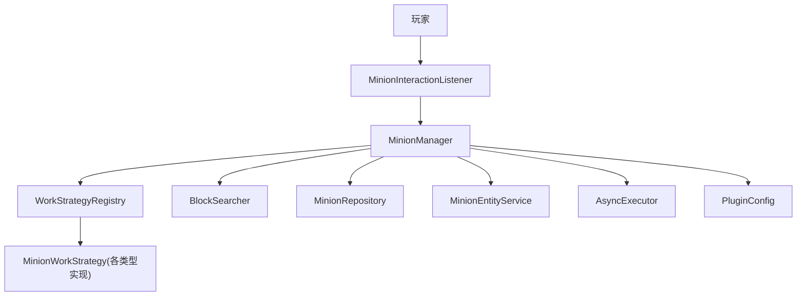
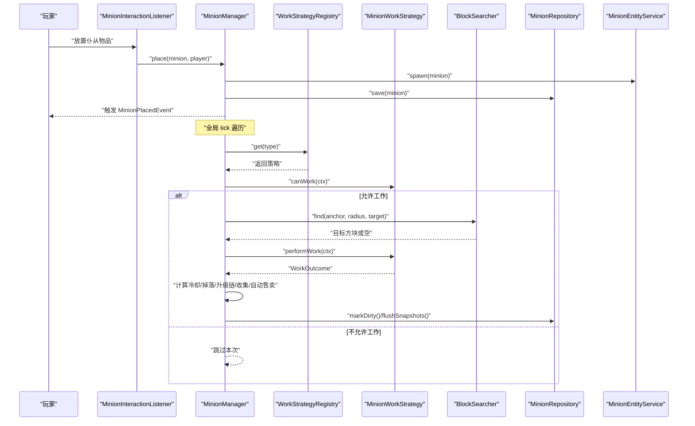
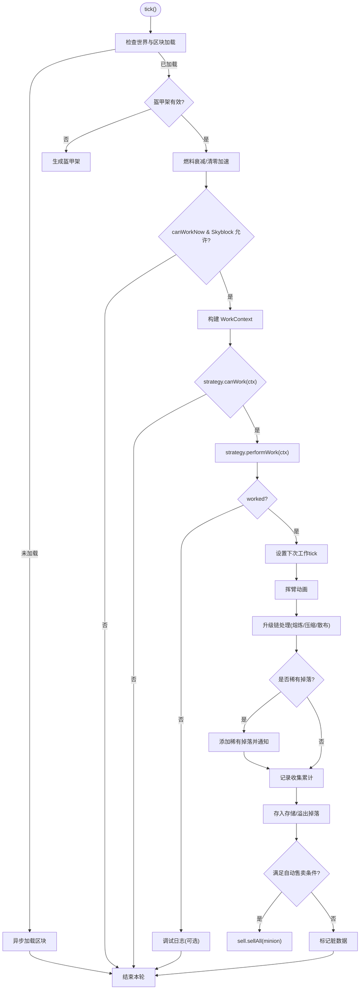
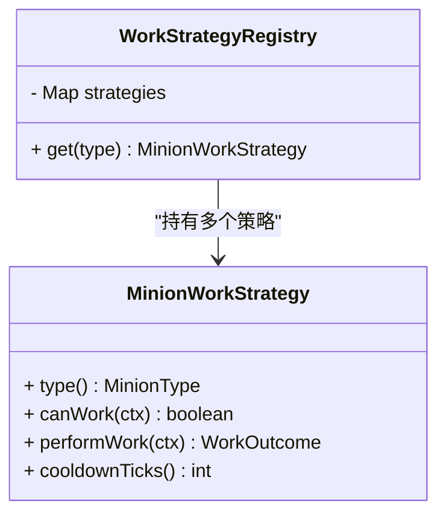
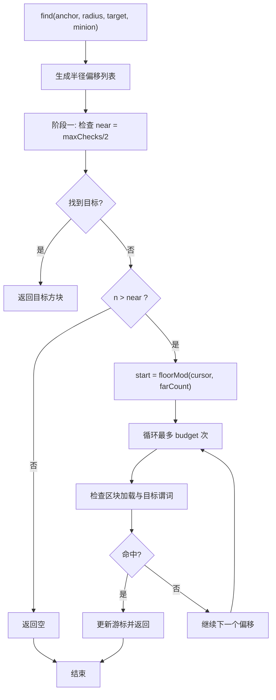
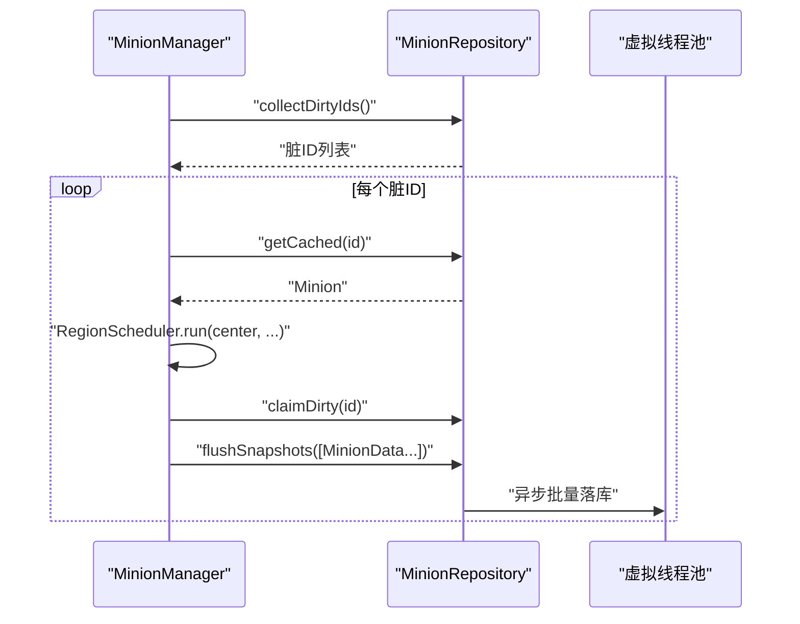
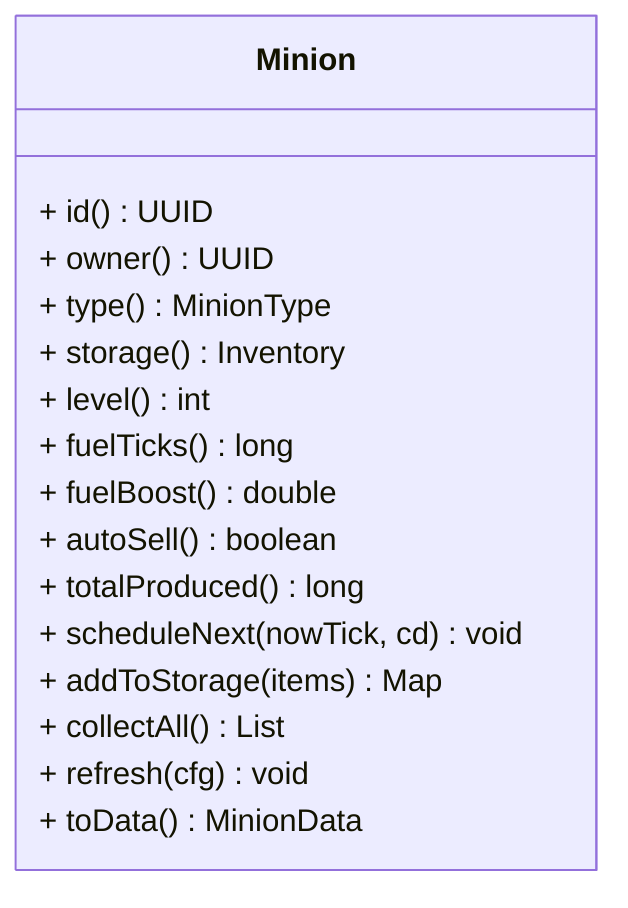
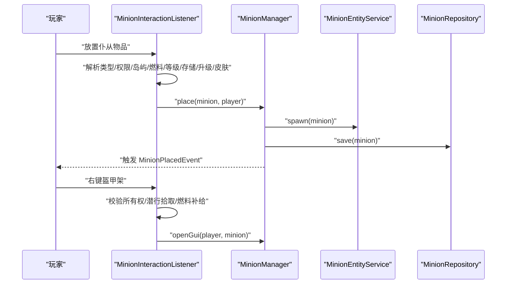
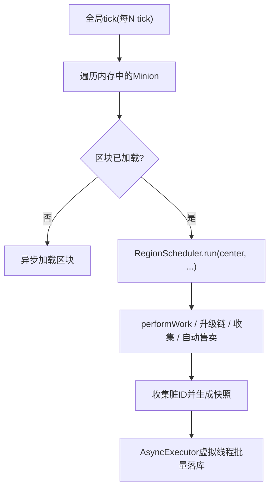
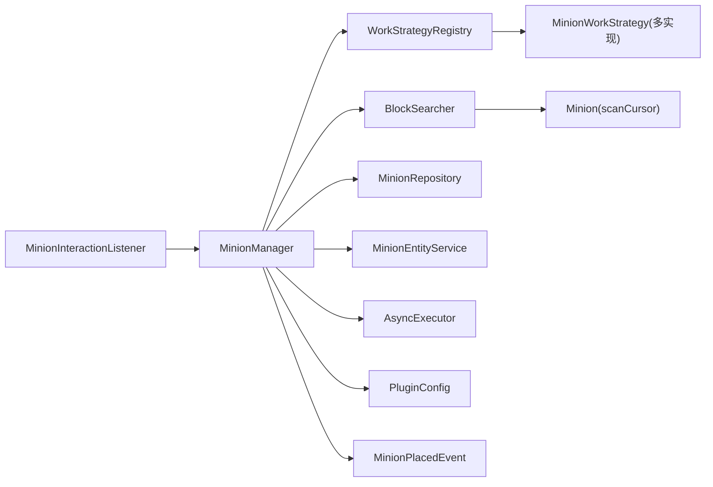

# 组件交互与数据流

<cite>
**本文引用的文件**
- [MinionManager.java](file://src/main/java/com/hcs/minions/service/MinionManager.java)
- [WorkStrategyRegistry.java](file://src/main/java/com/hcs/minions/work/WorkStrategyRegistry.java)
- [BlockSearcher.java](file://src/main/java/com/hcs/minions/service/BlockSearcher.java)
- [MinionRepository.java](file://src/main/java/com/hcs/minions/repository/MinionRepository.java)
- [Minion.java](file://src/main/java/com/hcs/minions/model/Minion.java)
- [MinionWorkStrategy.java](file://src/main/java/com/hcs/minions/work/MinionWorkStrategy.java)
- [WorkContext.java](file://src/main/java/com/hcs/minions/work/WorkContext.java)
- [WorkOutcome.java](file://src/main/java/com/hcs/minions/work/WorkOutcome.java)
- [MinionPlacedEvent.java](file://src/main/java/com/hcs/minions/event/MinionPlacedEvent.java)
- [MinionInteractionListener.java](file://src/main/java/com/hcs/minions/listener/MinionInteractionListener.java)
- [MinionEntityService.java](file://src/main/java/com/hcs/minions/service/MinionEntityService.java)
- [AsyncExecutor.java](file://src/main/java/com/hcs/minions/util/AsyncExecutor.java)
- [PluginConfig.java](file://src/main/java/com/hcs/minions/config/PluginConfig.java)
</cite>

## 目录
1. [简介](#简介)
2. [项目结构](#项目结构)
3. [核心组件](#核心组件)
4. [架构总览](#架构总览)
5. [详细组件分析](#详细组件分析)
6. [依赖关系分析](#依赖关系分析)
7. [性能考量](#性能考量)
8. [故障排查指南](#故障排查指南)
9. [结论](#结论)

## 简介
本文件聚焦仆从（Minion）插件中各服务组件的交互关系与数据流向，围绕 MinionManager、WorkStrategyRegistry、BlockSearcher、MinionRepository 等核心组件展开，完整说明从“玩家放置仆从”到“自动化工作执行”的全流程。文档同时解释事件驱动架构（Bukkit 事件监听与处理）、异步任务调度与同步操作的协调方式，并提供流程图与数据流图以直观展示组件协作。最后给出错误处理与异常传播机制说明及常见问题排查建议。

## 项目结构
- 业务入口与编排：MinionManager 负责全局 tick 遍历、工作编排、自动售卖轮询、GUI 打开、实体生成/销毁、持久化快照等。
- 策略注册表：WorkStrategyRegistry 将 MinionType 映射到具体工作策略，实现开闭原则。
- 方块搜索：BlockSearcher 提供限流的两阶段螺旋扫描，保证每周期检查数 < 50。
- 数据访问：MinionRepository 抽象持久化接口，内部包含内存缓存与虚拟线程异步落库，业务层无感知 IO。
- 模型与上下文：Minion 承载运行时状态与 GUI；WorkContext/WorkOutcome 封装单次工作上下文与结果。
- 事件与监听：MinionInteractionListener 监听放置与交互事件；MinionPlacedEvent 作为模块间解耦桥梁。
- 实体外观：MinionEntityService 管理盔甲架小人外观、动画与生命周期。
- 异步执行：AsyncExecutor 统一使用虚拟线程池与单线程调度器，隔离 IO 与周期性任务。
- 配置：PluginConfig 提供只读全局配置，限制最大检查次数等关键参数。

图表来源
- [MinionInteractionListener.java:54-94](file://src/main/java/com/hcs/minions/listener/MinionInteractionListener.java#L54-L94)
- [MinionManager.java:92-115](file://src/main/java/com/hcs/minions/service/MinionManager.java#L92-L115)
- [WorkStrategyRegistry.java:18-32](file://src/main/java/com/hcs/minions/work/WorkStrategyRegistry.java#L18-L32)
- [BlockSearcher.java:34-66](file://src/main/java/com/hcs/minions/service/BlockSearcher.java#L34-L66)
- [MinionRepository.java:18-43](file://src/main/java/com/hcs/minions/repository/MinionRepository.java#L18-L43)
- [MinionEntityService.java:43-75](file://src/main/java/com/hcs/minions/service/MinionEntityService.java#L43-L75)
- [AsyncExecutor.java:24-67](file://src/main/java/com/hcs/minions/util/AsyncExecutor.java#L24-L67)
- [PluginConfig.java:22-45](file://src/main/java/com/hcs/minions/config/PluginConfig.java#L22-L45)

章节来源
- [MinionManager.java:92-115](file://src/main/java/com/hcs/minions/service/MinionManager.java#L92-L115)
- [PluginConfig.java:22-45](file://src/main/java/com/hcs/minions/config/PluginConfig.java#L22-L45)

## 核心组件
- MinionManager：全局调度中心，维护仆从集合、索引、所有者计数；tick 遍历仅做内存与加载判断，区域相关操作委派 RegionScheduler；负责工作编排、掉落处理、升级链、收集累计、自动售卖、GUI 打开、实体生成/销毁、脏数据快照与批量落库。
- WorkStrategyRegistry：枚举键映射到工作策略，禁止 if-else 分支，新增类型仅需注册新策略。
- BlockSearcher：两阶段螺旋扫描，近处优先命中，远处游标推进，单周期检查上限受 PluginConfig.maxChecksPerCycle 约束。
- MinionRepository：面向业务的持久化抽象，支持异步 findAll/save/delete、脏标记收集与认领、region 线程生成快照后批量落库、主线程安全冲刷。
- Minion：运行时模型，含存储槽位、燃料、升级模块、皮肤、冷却时间、扫描游标、GUI 渲染等。
- MinionWorkStrategy/WorkContext/WorkOutcome：策略模式的工作接口与上下文/结果封装。
- MinionEntityService：盔甲架小人的生成、刷新外观、挥臂动画、销毁与清理。
- AsyncExecutor：统一虚拟线程异步执行与周期调度，隔离 IO 与主线程。
- 事件与监听：MinionInteractionListener 处理放置与交互；MinionPlacedEvent 用于模块解耦。

章节来源
- [MinionManager.java:44-86](file://src/main/java/com/hcs/minions/service/MinionManager.java#L44-L86)
- [WorkStrategyRegistry.java:10-32](file://src/main/java/com/hcs/minions/work/WorkStrategyRegistry.java#L10-L32)
- [BlockSearcher.java:14-32](file://src/main/java/com/hcs/minions/service/BlockSearcher.java#L14-L32)
- [MinionRepository.java:11-43](file://src/main/java/com/hcs/minions/repository/MinionRepository.java#L11-L43)
- [Minion.java:30-105](file://src/main/java/com/hcs/minions/model/Minion.java#L30-L105)
- [MinionWorkStrategy.java:5-25](file://src/main/java/com/hcs/minions/work/MinionWorkStrategy.java#L5-L25)
- [WorkContext.java:10-21](file://src/main/java/com/hcs/minions/work/WorkContext.java#L10-L21)
- [WorkOutcome.java:7-20](file://src/main/java/com/hcs/minions/work/WorkOutcome.java#L7-L20)
- [MinionEntityService.java:28-75](file://src/main/java/com/hcs/minions/service/MinionEntityService.java#L28-L75)
- [AsyncExecutor.java:12-67](file://src/main/java/com/hcs/minions/util/AsyncExecutor.java#L12-L67)
- [MinionPlacedEvent.java:9-39](file://src/main/java/com/hcs/minions/event/MinionPlacedEvent.java#L9-L39)
- [MinionInteractionListener.java:31-94](file://src/main/java/com/hcs/minions/listener/MinionInteractionListener.java#L31-L94)

## 架构总览
系统采用“事件驱动 + 策略模式 + 区域调度”的混合架构：
- 事件驱动：玩家放置/交互通过 Bukkit 事件进入 MinionInteractionListener，再路由到 MinionManager。
- 策略模式：MinionManager 通过 WorkStrategyRegistry 获取对应 MinionType 的工作策略，调用 canWork/performWork/cooldownTicks。
- 区域调度：所有涉及方块/实体/Inventory 的操作均在 RegionScheduler 上执行，确保 Folia 兼容与线程安全。
- 异步 IO：数据库与外部服务调用经 AsyncExecutor 使用虚拟线程执行，避免阻塞主线程。
- 限流搜索：BlockSearcher 控制每周期检查数量，防止性能抖动。

图表来源
- [MinionInteractionListener.java:54-94](file://src/main/java/com/hcs/minions/listener/MinionInteractionListener.java#L54-L94)
- [MinionManager.java:92-115](file://src/main/java/com/hcs/minions/service/MinionManager.java#L92-L115)
- [MinionManager.java:191-215](file://src/main/java/com/hcs/minions/service/MinionManager.java#L191-L215)
- [MinionManager.java:252-322](file://src/main/java/com/hcs/minions/service/MinionManager.java#L252-L322)
- [WorkStrategyRegistry.java:18-32](file://src/main/java/com/hcs/minions/work/WorkStrategyRegistry.java#L18-L32)
- [MinionWorkStrategy.java:15-25](file://src/main/java/com/hcs/minions/work/MinionWorkStrategy.java#L15-L25)
- [BlockSearcher.java:34-66](file://src/main/java/com/hcs/minions/service/BlockSearcher.java#L34-L66)
- [MinionRepository.java:22-43](file://src/main/java/com/hcs/minions/repository/MinionRepository.java#L22-L43)
- [MinionEntityService.java:43-75](file://src/main/java/com/hcs/minions/service/MinionEntityService.java#L43-L75)

## 详细组件分析

### MinionManager：全局调度与工作编排
- 启动时加载全部仆从并建立内存索引（按 ID、位置、所有者计数），启动全局 tick 任务与自动售卖轮询。
- tick 遍历只做轻量判断（世界/区块加载、附近玩家存在性），真正触碰方块/实体的逻辑委派给 RegionScheduler。
- performWork 构建 WorkContext，调用策略 canWork/performWork，捕获异常并记录日志；根据 WorkOutcome 设置冷却、挥臂动画、升级链处理、稀有掉落、收集累计、存入存储或掉落地面、自动售卖触发、标记脏数据。
- 自动售卖在 GlobalRegionScheduler 轮询，逐个委派到 region 线程判断并售卖，避免跨线程访问 Inventory。
- 停止时关闭任务、关闭 GUI、同步冲刷脏数据、销毁实体、清空内存索引。

图表来源
- [MinionManager.java:191-215](file://src/main/java/com/hcs/minions/service/MinionManager.java#L191-L215)
- [MinionManager.java:218-250](file://src/main/java/com/hcs/minions/service/MinionManager.java#L218-L250)
- [MinionManager.java:252-322](file://src/main/java/com/hcs/minions/service/MinionManager.java#L252-L322)
- [MinionManager.java:333-350](file://src/main/java/com/hcs/minions/service/MinionManager.java#L333-L350)

章节来源
- [MinionManager.java:92-115](file://src/main/java/com/hcs/minions/service/MinionManager.java#L92-L115)
- [MinionManager.java:191-215](file://src/main/java/com/hcs/minions/service/MinionManager.java#L191-L215)
- [MinionManager.java:218-322](file://src/main/java/com/hcs/minions/service/MinionManager.java#L218-L322)
- [MinionManager.java:333-350](file://src/main/java/com/hcs/minions/service/MinionManager.java#L333-L350)

### WorkStrategyRegistry：策略注册与查找
- 构造时接收所有 MinionWorkStrategy 实例，构建不可变 EnumMap 映射。
- get(type) 若未注册则抛出异常，强制扩展点规范。

图表来源
- [WorkStrategyRegistry.java:18-32](file://src/main/java/com/hcs/minions/work/WorkStrategyRegistry.java#L18-L32)
- [MinionWorkStrategy.java:10-25](file://src/main/java/com/hcs/minions/work/MinionWorkStrategy.java#L10-L25)

章节来源
- [WorkStrategyRegistry.java:10-32](file://src/main/java/com/hcs/minions/work/WorkStrategyRegistry.java#L10-L32)
- [MinionWorkStrategy.java:5-25](file://src/main/java/com/hcs/minions/work/MinionWorkStrategy.java#L5-L25)

### BlockSearcher：限流方块搜索
- 两阶段螺旋扫描：阶段一固定检查最近偏移，阶段二基于 minion.scanCursor 推进远处偏移，单周期检查总数受 maxChecksPerCycle 限制。
- 仅当区块已加载且满足目标谓词时才返回，否则继续推进游标。

图表来源
- [BlockSearcher.java:34-66](file://src/main/java/com/hcs/minions/service/BlockSearcher.java#L34-L66)
- [BlockSearcher.java:68-91](file://src/main/java/com/hcs/minions/service/BlockSearcher.java#L68-L91)
- [PluginConfig.java:22-45](file://src/main/java/com/hcs/minions/config/PluginConfig.java#L22-L45)

章节来源
- [BlockSearcher.java:14-66](file://src/main/java/com/hcs/minions/service/BlockSearcher.java#L14-L66)
- [PluginConfig.java:22-45](file://src/main/java/com/hcs/minions/config/PluginConfig.java#L22-L45)

### MinionRepository：数据访问与持久化
- 暴露 findAll/save/delete/collectDirtyIds/getCached/claimDirty/flushSnapshots/flushDirtySync 等方法。
- 业务层不感知 IO 细节；快照生成在 region 线程进行，避免 Inventory 并发问题；批量落库使用虚拟线程异步执行。

图表来源
- [MinionManager.java:124-160](file://src/main/java/com/hcs/minions/service/MinionManager.java#L124-L160)
- [MinionRepository.java:18-43](file://src/main/java/com/hcs/minions/repository/MinionRepository.java#L18-L43)
- [AsyncExecutor.java:34-67](file://src/main/java/com/hcs/minions/util/AsyncExecutor.java#L34-L67)

章节来源
- [MinionRepository.java:11-43](file://src/main/java/com/hcs/minions/repository/MinionRepository.java#L11-L43)
- [MinionManager.java:124-160](file://src/main/java/com/hcs/minions/service/MinionManager.java#L124-L160)

### Minion：运行时模型与 GUI
- 维护存储槽位、燃料、升级模块、皮肤、冷却时间、扫描游标、GUI 渲染等。
- 提供 addToStorage/removeItems/collectAll/consume 等仓库操作，均标记脏数据。
- refresh 方法根据配置与当前状态渲染 GUI，信息卡显示速度、产出率、范围、存储、稀有掉落等信息。

图表来源
- [Minion.java:30-105](file://src/main/java/com/hcs/minions/model/Minion.java#L30-L105)
- [Minion.java:175-226](file://src/main/java/com/hcs/minions/model/Minion.java#L175-L226)
- [Minion.java:289-322](file://src/main/java/com/hcs/minions/model/Minion.java#L289-L322)
- [Minion.java:718-743](file://src/main/java/com/hcs/minions/model/Minion.java#L718-L743)

章节来源
- [Minion.java:30-105](file://src/main/java/com/hcs/minions/model/Minion.java#L30-L105)
- [Minion.java:175-226](file://src/main/java/com/hcs/minions/model/Minion.java#L175-L226)
- [Minion.java:289-322](file://src/main/java/com/hcs/minions/model/Minion.java#L289-L322)
- [Minion.java:718-743](file://src/main/java/com/hcs/minions/model/Minion.java#L718-L743)

### 事件驱动：放置与交互
- MinionInteractionListener 监听 BlockPlaceEvent 与 PlayerInteractAtEntityEvent。
- 放置流程：解析类型/权限/岛屿限制/燃料/等级/存储/升级/皮肤 -> 创建 Minion -> manager.place -> 保存并触发 MinionPlacedEvent。
- 交互流程：右键盔甲架 -> 校验所有权 -> 潜行拾取/手持燃料补给/打开 GUI。

图表来源
- [MinionInteractionListener.java:54-94](file://src/main/java/com/hcs/minions/listener/MinionInteractionListener.java#L54-L94)
- [MinionInteractionListener.java:98-142](file://src/main/java/com/hcs/minions/listener/MinionInteractionListener.java#L98-L142)
- [MinionPlacedEvent.java:9-39](file://src/main/java/com/hcs/minions/event/MinionPlacedEvent.java#L9-L39)
- [MinionEntityService.java:43-75](file://src/main/java/com/hcs/minions/service/MinionEntityService.java#L43-L75)

章节来源
- [MinionInteractionListener.java:54-94](file://src/main/java/com/hcs/minions/listener/MinionInteractionListener.java#L54-L94)
- [MinionInteractionListener.java:98-142](file://src/main/java/com/hcs/minions/listener/MinionInteractionListener.java#L98-L142)
- [MinionPlacedEvent.java:9-39](file://src/main/java/com/hcs/minions/event/MinionPlacedEvent.java#L9-L39)

### 异步任务调度与同步协调
- 全局 tick 使用 Bukkit.getGlobalRegionScheduler().runAtFixedRate，但遍历内对区域绑定操作使用 Bukkit.getRegionScheduler().run 委派到对应区域线程。
- 自动售卖轮询同样在 GlobalRegionScheduler，逐条委派到 region 线程判断并售卖。
- 快照落库使用 AsyncExecutor 的虚拟线程池异步批量写入，避免阻塞主线程。
- 所有 Inventory 访问严格在 region 线程执行，确保线程安全与 Folia 兼容。

图表来源
- [MinionManager.java:92-115](file://src/main/java/com/hcs/minions/service/MinionManager.java#L92-L115)
- [MinionManager.java:191-215](file://src/main/java/com/hcs/minions/service/MinionManager.java#L191-L215)
- [MinionManager.java:124-160](file://src/main/java/com/hcs/minions/service/MinionManager.java#L124-L160)
- [AsyncExecutor.java:34-67](file://src/main/java/com/hcs/minions/util/AsyncExecutor.java#L34-L67)

章节来源
- [MinionManager.java:92-115](file://src/main/java/com/hcs/minions/service/MinionManager.java#L92-L115)
- [MinionManager.java:124-160](file://src/main/java/com/hcs/minions/service/MinionManager.java#L124-L160)
- [MinionManager.java:191-215](file://src/main/java/com/hcs/minions/service/MinionManager.java#L191-L215)
- [AsyncExecutor.java:34-67](file://src/main/java/com/hcs/minions/util/AsyncExecutor.java#L34-L67)

## 依赖关系分析
- MinionManager 依赖 WorkStrategyRegistry、BlockSearcher、MinionRepository、MinionEntityService、AsyncExecutor、PluginConfig 等。
- WorkStrategyRegistry 依赖 MinionWorkStrategy 的具体实现（由插件初始化时注入）。
- BlockSearcher 依赖 Minion 的 scanCursor 推进游标，受 PluginConfig.maxChecksPerCycle 限制。
- MinionRepository 被 MinionManager 用于加载、保存、删除、快照与批量落库。
- MinionEntityService 被 MinionManager 与 MinionInteractionListener 用于实体生成/销毁/外观刷新。
- 事件 MinionPlacedEvent 由 MinionManager 触发，供其他模块订阅。

图表来源
- [MinionManager.java:44-86](file://src/main/java/com/hcs/minions/service/MinionManager.java#L44-L86)
- [WorkStrategyRegistry.java:18-32](file://src/main/java/com/hcs/minions/work/WorkStrategyRegistry.java#L18-L32)
- [BlockSearcher.java:34-66](file://src/main/java/com/hcs/minions/service/BlockSearcher.java#L34-L66)
- [MinionRepository.java:18-43](file://src/main/java/com/hcs/minions/repository/MinionRepository.java#L18-L43)
- [MinionEntityService.java:43-75](file://src/main/java/com/hcs/minions/service/MinionEntityService.java#L43-L75)
- [AsyncExecutor.java:24-67](file://src/main/java/com/hcs/minions/util/AsyncExecutor.java#L24-L67)
- [PluginConfig.java:22-45](file://src/main/java/com/hcs/minions/config/PluginConfig.java#L22-L45)
- [MinionInteractionListener.java:54-94](file://src/main/java/com/hcs/minions/listener/MinionInteractionListener.java#L54-L94)
- [MinionPlacedEvent.java:9-39](file://src/main/java/com/hcs/minions/event/MinionPlacedEvent.java#L9-L39)

章节来源
- [MinionManager.java:44-86](file://src/main/java/com/hcs/minions/service/MinionManager.java#L44-L86)
- [WorkStrategyRegistry.java:18-32](file://src/main/java/com/hcs/minions/work/WorkStrategyRegistry.java#L18-L32)
- [BlockSearcher.java:34-66](file://src/main/java/com/hcs/minions/service/BlockSearcher.java#L34-L66)
- [MinionRepository.java:18-43](file://src/main/java/com/hcs/minions/repository/MinionRepository.java#L18-L43)
- [MinionEntityService.java:43-75](file://src/main/java/com/hcs/minions/service/MinionEntityService.java#L43-L75)
- [AsyncExecutor.java:24-67](file://src/main/java/com/hcs/minions/util/AsyncExecutor.java#L24-L67)
- [PluginConfig.java:22-45](file://src/main/java/com/hcs/minions/config/PluginConfig.java#L22-L45)
- [MinionInteractionListener.java:54-94](file://src/main/java/com/hcs/minions/listener/MinionInteractionListener.java#L54-L94)
- [MinionPlacedEvent.java:9-39](file://src/main/java/com/hcs/minions/event/MinionPlacedEvent.java#L9-L39)

## 性能考量
- 全局 tick 仅做内存与加载判断，区域绑定操作委派 RegionScheduler，避免跨线程访问导致的不一致与崩溃。
- BlockSearcher 两阶段扫描与硬上限（maxChecksPerCycle < 50）确保每周期检查数可控，防止性能抖动。
- 快照落库使用虚拟线程批量写入，减少主线程阻塞；仅在必要时生成快照（claimDirty CAS）。
- 自动售卖轮询在 GlobalRegionScheduler 上执行，逐条委派到 region 线程判断并售卖，避免 Inventory 并发问题。
- 盔甲架实体 setPersistent(false)，重载后按数据自愈，减少持久化负担。

[本节为通用性能讨论，不直接分析具体文件]

## 故障排查指南
- 工作异常：MinionManager.performWork 捕获异常并记录日志，便于定位策略实现中的问题。
- 区块加载失败：tick 中异步加载区块失败会记录错误日志，检查服务器负载与区块生成配置。
- 未注册策略：WorkStrategyRegistry.get(type) 抛出异常，确认策略是否正确注册。
- Inventory 并发问题：确保所有 Inventory 访问在 RegionScheduler 上执行，避免在主线程之外直接操作。
- 自动售卖无效：检查 shouldAutoSell 条件与 sellIntervalTicks 配置，确认存储已满且开启自动售卖。
- 实体残留：stop 时 despawnAll 与 purgeOrphans 清理孤儿实体，避免重启后残留。

章节来源
- [MinionManager.java:252-322](file://src/main/java/com/hcs/minions/service/MinionManager.java#L252-L322)
- [MinionManager.java:191-215](file://src/main/java/com/hcs/minions/service/MinionManager.java#L191-L215)
- [WorkStrategyRegistry.java:26-32](file://src/main/java/com/hcs/minions/work/WorkStrategyRegistry.java#L26-L32)
- [MinionManager.java:162-180](file://src/main/java/com/hcs/minions/service/MinionManager.java#L162-L180)

## 结论
本插件通过事件驱动、策略模式与区域调度实现了高内聚、低耦合的仆从自动化系统。MinionManager 作为编排中心，结合 WorkStrategyRegistry 与 BlockSearcher 完成高效工作调度；MinionRepository 提供线程安全的持久化抽象；MinionEntityService 负责实体外观与生命周期；AsyncExecutor 统一异步 IO 与周期任务。整体设计在保证响应性与性能的同时，提供了良好的可扩展性与可维护性。