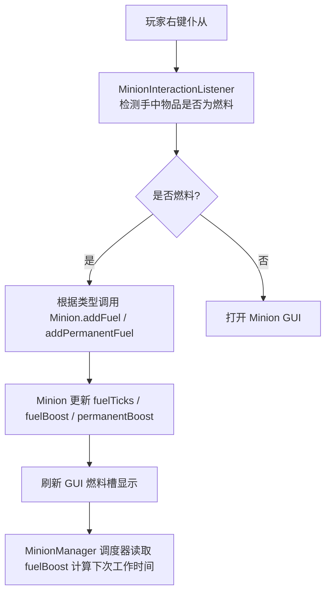
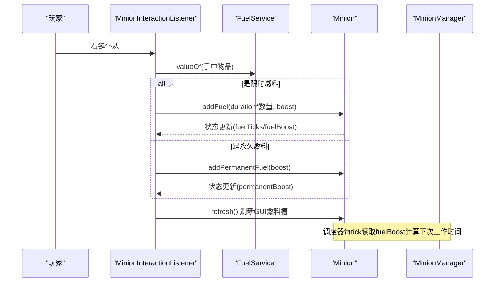
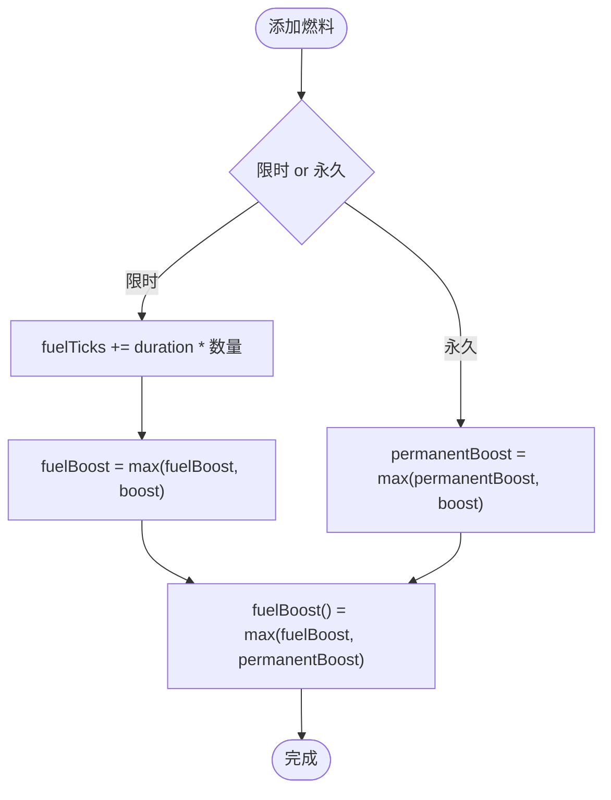
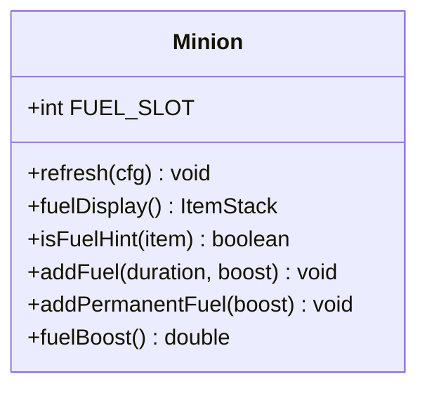
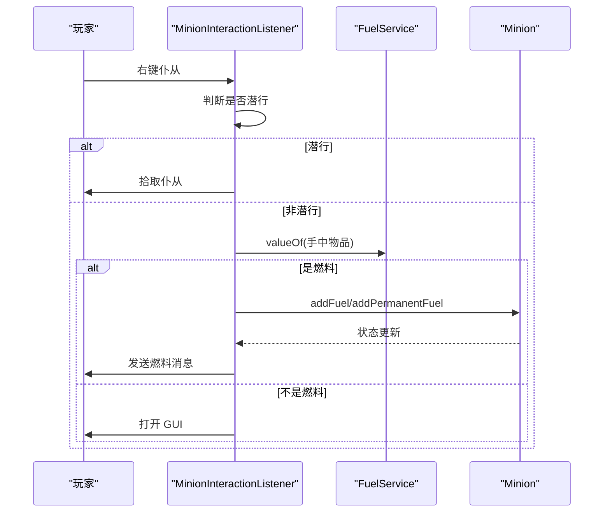
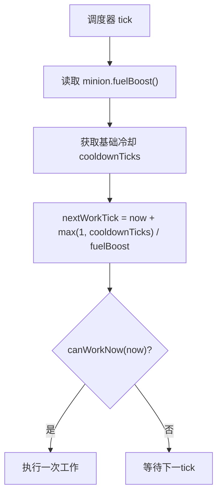
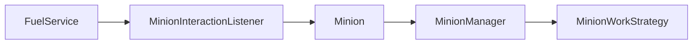

# 燃料系统

<cite>
**本文引用的文件**
- [FuelService.java](file://src/main/java/com/hcs/minions/service/FuelService.java)
- [MinionInteractionListener.java](file://src/main/java/com/hcs/minions/listener/MinionInteractionListener.java)
- [Minion.java](file://src/main/java/com/hcs/minions/model/Minion.java)
- [config.yml](file://src/main/resources/config.yml)
- [Messages.java](file://src/main/java/com/hcs/minions/util/Messages.java)
- [MinionManager.java](file://src/main/java/com/hcs/minions/service/MinionManager.java)
- [MinionWorkStrategy.java](file://src/main/java/com/hcs/minions/work/MinionWorkStrategy.java)
</cite>

## 目录
1. [简介](#简介)
2. [项目结构](#项目结构)
3. [核心组件](#核心组件)
4. [架构总览](#架构总览)
5. [详细组件分析](#详细组件分析)
6. [依赖关系分析](#依赖关系分析)
7. [性能考量](#性能考量)
8. [故障排除指南](#故障排除指南)
9. [结论](#结论)
10. [附录](#附录)

## 简介
本文件为 SkyMinions 的“燃料系统”技术文档，聚焦于仆从的效率加速机制。系统支持两类燃料：
- 限时燃料：提供一段时间的速度加成，随时间衰减（如煤炭、岩浆桶、烈焰棒等）。
- 永久燃料：提供持续速度加成，不随时间衰减（如岩浆膏、荧石粉、日光传感器等）。

无燃料时仆从仍会工作，但效率较低；加入燃料后，工作速度提升，产出速率相应提高。本文档将详细说明燃料类型与数值、消耗算法、效果持续时间、叠加规则、UI 槽位设计、检测逻辑、自动添加机制、对工作效率的影响、配置项设置方法、优化策略与最佳实践，以及常见问题排查。

## 项目结构
与燃料系统直接相关的代码与资源分布如下：
- 燃料定义与查询：FuelService
- 玩家交互与自动添加：MinionInteractionListener
- 仆从状态与 GUI 渲染：Minion
- 全局调度与工作循环：MinionManager
- 工作策略接口（含冷却）：MinionWorkStrategy
- 配置文件（含燃料说明注释）：config.yml
- 消息文案（含燃料反馈）：Messages

**图表来源**
- [MinionInteractionListener.java:121-142](file://src/main/java/com/hcs/minions/listener/MinionInteractionListener.java#L121-L142)
- [Minion.java:651-662](file://src/main/java/com/hcs/minions/model/Minion.java#L651-L662)
- [MinionManager.java:191-200](file://src/main/java/com/hcs/minions/service/MinionManager.java#L191-L200)

**章节来源**
- [FuelService.java:1-53](file://src/main/java/com/hcs/minions/service/FuelService.java#L1-L53)
- [MinionInteractionListener.java:121-142](file://src/main/java/com/hcs/minions/listener/MinionInteractionListener.java#L121-L142)
- [Minion.java:285-321](file://src/main/java/com/hcs/minions/model/Minion.java#L285-L321)
- [config.yml:29-31](file://src/main/resources/config.yml#L29-L31)

## 核心组件
- FuelService：集中维护“材料 -> 燃料属性”的映射，区分限时与永久燃料，并提供 isFuel/valueOf 查询。
- Minion：维护仆从运行时状态（fuelTicks、fuelBoost、permanentBoost），提供添加燃料、获取最终加速倍率的方法，并负责 GUI 燃料槽展示。
- MinionInteractionListener：处理玩家右键仆从时的行为，若手持物品为燃料则自动添加，否则打开 GUI。
- MinionManager：全局调度器，按 tick 周期遍历所有仆从，结合工作策略与燃料倍率安排下一次工作时间。
- MinionWorkStrategy：定义工作策略接口，包含基础冷却 tick，供 Manager 在调度时参考。
- Messages：提供燃料相关消息模板（已装备永久燃料、已补充燃料等）。

**章节来源**
- [FuelService.java:1-53](file://src/main/java/com/hcs/minions/service/FuelService.java#L1-L53)
- [Minion.java:624-662](file://src/main/java/com/hcs/minions/model/Minion.java#L624-L662)
- [MinionInteractionListener.java:121-142](file://src/main/java/com/hcs/minions/listener/MinionInteractionListener.java#L121-L142)
- [MinionManager.java:191-200](file://src/main/java/com/hcs/minions/service/MinionManager.java#L191-L200)
- [MinionWorkStrategy.java:10-26](file://src/main/java/com/hcs/minions/work/MinionWorkStrategy.java#L10-L26)
- [Messages.java:177-183](file://src/main/java/com/hcs/minions/util/Messages.java#L177-L183)

## 架构总览
燃料系统的整体流程如下：
- 玩家右键仆从：监听器判断手中物品是否为燃料。
- 若是燃料：
  - 限时燃料：累加 durationTicks * 数量，并取最大 boost。
  - 永久燃料：取最大 permanentBoost（不衰减）。
- 更新 Minion 状态后刷新 GUI 燃料槽显示。
- 调度器在 tick 中读取 Minion.fuelBoost() 与基础冷却，计算下次可工作时间，从而决定工作频率。

**图表来源**
- [MinionInteractionListener.java:121-142](file://src/main/java/com/hcs/minions/listener/MinionInteractionListener.java#L121-L142)
- [FuelService.java:29-51](file://src/main/java/com/hcs/minions/service/FuelService.java#L29-L51)
- [Minion.java:651-662](file://src/main/java/com/hcs/minions/model/Minion.java#L651-L662)
- [MinionManager.java:191-200](file://src/main/java/com/hcs/minions/service/MinionManager.java#L191-L200)

## 详细组件分析

### 燃料类型与数值（FuelService）
- 限时燃料：
  - 煤炭/木炭：+5% 速度，持续 3600 tick（约 3 分钟）
  - 煤块：+5% 速度，持续 18000 tick（约 15 分钟）
  - 岩浆桶：+25% 速度，持续 72000 tick（约 60 分钟）
  - 烈焰棒：+30% 速度，持续 21600 tick（约 18 分钟）
- 永久燃料（不衰减）：
  - 岩浆膏：+30% 速度
  - 荧石粉：+35% 速度
  - 日光传感器：+25% 速度

这些数值由 FuelService 内部 Map 固定维护，isFuel/valueOf 用于识别与取值。

**章节来源**
- [FuelService.java:29-51](file://src/main/java/com/hcs/minions/service/FuelService.java#L29-L51)
- [config.yml:29-31](file://src/main/resources/config.yml#L29-L31)

### 燃料叠加规则（Minion）
- 限时燃料：
  - 时间叠加：durationTicks 累加。
  - 加速倍率：取当前 fuelBoost 与新 boost 的最大值。
- 永久燃料：
  - 仅保留最高 permanentBoost（不衰减）。
- 最终加速倍率：
  - fuelBoost() = max(fuelBoost, permanentBoost)。
  - 即限时与永久两种加速同时存在时，以更高者为准。

**图表来源**
- [Minion.java:651-662](file://src/main/java/com/hcs/minions/model/Minion.java#L651-L662)
- [Minion.java:633-635](file://src/main/java/com/hcs/minions/model/Minion.java#L633-L635)

**章节来源**
- [Minion.java:624-662](file://src/main/java/com/hcs/minions/model/Minion.java#L624-L662)

### 燃料消耗算法与效果持续时间
- 限时燃料：
  - 通过 fuelTicks 记录剩余 tick 数。
  - 每次工作前，调度器会根据基础冷却与燃料倍率计算下次工作时间，体现“速度提升”。
  - 随着时间推进，fuelTicks 减少直至归零，限时加速消失。
- 永久燃料：
  - 不随时间衰减，permanentBoost 保持有效直到被更高倍率的永久燃料覆盖。
- 无燃料：
  - 仆从仍工作，但效率为基础效率（无额外加速）。

注意：具体“消耗”表现为时间递减与倍率影响工作间隔，而非直接扣减物品数量（限时燃料通过 tick 计数实现）。

**章节来源**
- [Minion.java:624-662](file://src/main/java/com/hcs/minions/model/Minion.java#L624-L662)
- [MinionManager.java:191-200](file://src/main/java/com/hcs/minions/service/MinionManager.java#L191-L200)

### UI 设计与燃料槽（Minion GUI）
- 燃料槽位于 GUI 顶行第 0 格（FUEL_SLOT=0）。
- 当槽为空或为占位提示时，刷新为燃料展示物品，显示：
  - 永久加速百分比（若有）
  - 限时剩余秒数与当前限时加速百分比（若有）
  - 可用燃料列表（限时/永久）
  - 操作提示（放入本格自动生效）
- 占位提示使用 PDC 标记区分真燃料，避免关闭 GUI 时被误判为燃料消耗。

**图表来源**
- [Minion.java:40-63](file://src/main/java/com/hcs/minions/model/Minion.java#L40-L63)
- [Minion.java:304-321](file://src/main/java/com/hcs/minions/model/Minion.java#L304-L321)
- [Minion.java:408-446](file://src/main/java/com/hcs/minions/model/Minion.java#L408-L446)
- [Minion.java:651-662](file://src/main/java/com/hcs/minions/model/Minion.java#L651-L662)

**章节来源**
- [Minion.java:285-321](file://src/main/java/com/hcs/minions/model/Minion.java#L285-L321)
- [Minion.java:408-446](file://src/main/java/com/hcs/minions/model/Minion.java#L408-L446)

### 燃料检测逻辑与自动添加（MinionInteractionListener）
- 玩家右键仆从：
  - 若潜行：拾取仆从。
  - 若非潜行：检查手中物品是否为燃料。
  - 若是燃料：
    - 永久燃料：调用 addPermanentFuel，扣除手中数量，发送“已装备永久燃料”消息。
    - 限时燃料：调用 addFuel，清空手中物品，发送“已补充燃料”消息。
  - 若不是燃料：打开 GUI。

**图表来源**
- [MinionInteractionListener.java:121-142](file://src/main/java/com/hcs/minions/listener/MinionInteractionListener.java#L121-L142)
- [FuelService.java:46-51](file://src/main/java/com/hcs/minions/service/FuelService.java#L46-L51)
- [Minion.java:651-662](file://src/main/java/com/hcs/minions/model/Minion.java#L651-L662)

**章节来源**
- [MinionInteractionListener.java:121-142](file://src/main/java/com/hcs/minions/listener/MinionInteractionListener.java#L121-L142)

### 对工作效率的影响（调度与工作）
- 基础冷却：由工作策略提供 cooldownTicks。
- 实际工作间隔：受燃料倍率影响，燃料越高，单位时间工作次数越多。
- 调度器在 tick 中读取 Minion.fuelBoost()，并结合基础冷却计算 nextWorkTick，从而实现“速度提升”。

**图表来源**
- [MinionManager.java:191-200](file://src/main/java/com/hcs/minions/service/MinionManager.java#L191-L200)
- [MinionWorkStrategy.java:24-26](file://src/main/java/com/hcs/minions/work/MinionWorkStrategy.java#L24-L26)
- [Minion.java:767-777](file://src/main/java/com/hcs/minions/model/Minion.java#L767-L777)

**章节来源**
- [MinionManager.java:191-200](file://src/main/java/com/hcs/minions/service/MinionManager.java#L191-L200)
- [MinionWorkStrategy.java:10-26](file://src/main/java/com/hcs/minions/work/MinionWorkStrategy.java#L10-L26)
- [Minion.java:767-777](file://src/main/java/com/hcs/minions/model/Minion.java#L767-L777)

### 配置选项设置方法
- config.yml 中包含燃料说明注释，列出限时与永久燃料及其加速百分比。
- 可通过修改对应条目调整燃料类型与数值（需同步更新 FuelService 中的映射）。
- 其他相关配置：
  - tick-period：调度周期（tick）
  - max-minions-per-player：每玩家仆从上限
  - economy.auto-sell-on-full：仓库满时自动售卖开关
  - offline.*：离线收益相关

**章节来源**
- [config.yml:1-31](file://src/main/resources/config.yml#L1-L31)

## 依赖关系分析
- FuelService 被 MinionInteractionListener 用于识别燃料。
- MinionInteractionListener 调用 Minion 的燃料添加方法。
- Minion 的状态变化影响 GUI 显示与调度器的计算。
- MinionManager 在 tick 中读取 Minion 的燃料倍率，驱动工作节奏。
- MinionWorkStrategy 提供基础冷却，作为调度依据之一。

**图表来源**
- [FuelService.java:46-51](file://src/main/java/com/hcs/minions/service/FuelService.java#L46-L51)
- [MinionInteractionListener.java:121-142](file://src/main/java/com/hcs/minions/listener/MinionInteractionListener.java#L121-L142)
- [Minion.java:624-662](file://src/main/java/com/hcs/minions/model/Minion.java#L624-L662)
- [MinionManager.java:191-200](file://src/main/java/com/hcs/minions/service/MinionManager.java#L191-L200)
- [MinionWorkStrategy.java:24-26](file://src/main/java/com/hcs/minions/work/MinionWorkStrategy.java#L24-L26)

**章节来源**
- [FuelService.java:46-51](file://src/main/java/com/hcs/minions/service/FuelService.java#L46-L51)
- [MinionInteractionListener.java:121-142](file://src/main/java/com/hcs/minions/listener/MinionInteractionListener.java#L121-L142)
- [Minion.java:624-662](file://src/main/java/com/hcs/minions/model/Minion.java#L624-L662)
- [MinionManager.java:191-200](file://src/main/java/com/hcs/minions/service/MinionManager.java#L191-L200)
- [MinionWorkStrategy.java:24-26](file://src/main/java/com/hcs/minions/work/MinionWorkStrategy.java#L24-L26)

## 性能考量
- 燃料检测为 O(1) 查找（Map 键值），开销极低。
- 限时燃料的时间累加与永久燃料的最大值比较均为常数时间操作。
- GUI 刷新仅在交互或状态变更时触发，避免频繁重绘。
- 调度器在 tick 中仅进行轻量级只读判断，区域绑定操作委派到 RegionScheduler，保证线程安全与性能。

[本节为通用性能讨论，无需特定文件引用]

## 故障排除指南
- 问题：加入燃料后没有加速效果
  - 检查手中物品是否为受支持的燃料类型（查看 FuelService 映射）。
  - 确认已正确右键仆从且未潜行（潜行会拾取仆从）。
  - 查看 GUI 燃料槽是否显示正确的剩余时间与加速百分比。
- 问题：限时燃料很快耗尽
  - 确认添加的是限时燃料，其 durationTicks 有限；如需长期加速请使用永久燃料。
  - 检查是否有更高倍率的永久燃料覆盖了当前临时加速。
- 问题：GUI 燃料槽显示异常
  - 确认槽内物品未被误判为燃料（占位提示使用 PDC 标记区分）。
  - 刷新 GUI 后观察燃料槽是否恢复默认提示。
- 问题：消息未显示或显示错误
  - 检查 messages.yml 是否包含对应的燃料消息键（permanent-fuel-equipped、fuel-added）。
  - 使用 /minion reload 热重载消息与配置。

**章节来源**
- [FuelService.java:46-51](file://src/main/java/com/hcs/minions/service/FuelService.java#L46-L51)
- [MinionInteractionListener.java:121-142](file://src/main/java/com/hcs/minions/listener/MinionInteractionListener.java#L121-L142)
- [Minion.java:408-446](file://src/main/java/com/hcs/minions/model/Minion.java#L408-L446)
- [Messages.java:177-183](file://src/main/java/com/hcs/minions/util/Messages.java#L177-L183)

## 结论
SkyMinions 的燃料系统通过简洁清晰的“限时/永久”双轨机制，实现了灵活可控的仆从效率加速。限时燃料适合短期爆发，永久燃料适合长期稳定提升。系统在设计上注重性能与可维护性：O(1) 燃料检测、常量时间状态更新、GUI 按需刷新、调度器轻量只读判断。配合合理的配置与最佳实践，可显著提升自动化采集效率。

[本节为总结性内容，无需特定文件引用]

## 附录

### 燃料类型速查表
- 限时燃料：
  - 煤炭/木炭：+5%，3600 tick
  - 煤块：+5%，18000 tick
  - 岩浆桶：+25%，72000 tick
  - 烈焰棒：+30%，21600 tick
- 永久燃料：
  - 岩浆膏：+30%
  - 荧石粉：+35%
  - 日光传感器：+25%

**章节来源**
- [FuelService.java:29-51](file://src/main/java/com/hcs/minions/service/FuelService.java#L29-L51)
- [config.yml:29-31](file://src/main/resources/config.yml#L29-L31)

### 最佳实践建议
- 日常运营：优先使用永久燃料维持稳定高产出；在需要短时爆发时使用限时燃料。
- 堆叠策略：大量限时燃料可叠加时间，但加速倍率取最大值；因此多份相同限时燃料主要延长持续时间。
- GUI 管理：定期打开 GUI 查看燃料槽状态，确保燃料槽未被占位提示覆盖。
- 配置调优：根据服务器 TPS 与玩家需求调整 tick-period 与 max-checks-per-cycle，平衡性能与响应速度。
- 消息定制：通过 messages.yml 自定义燃料相关消息，提升用户体验。

[本节为通用建议，无需特定文件引用]