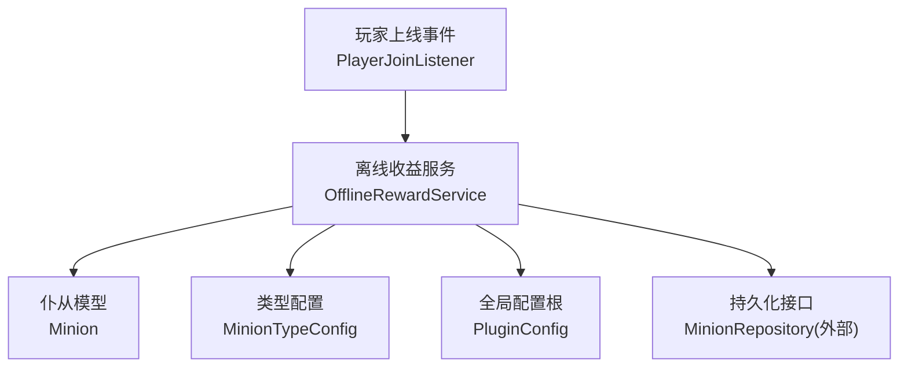
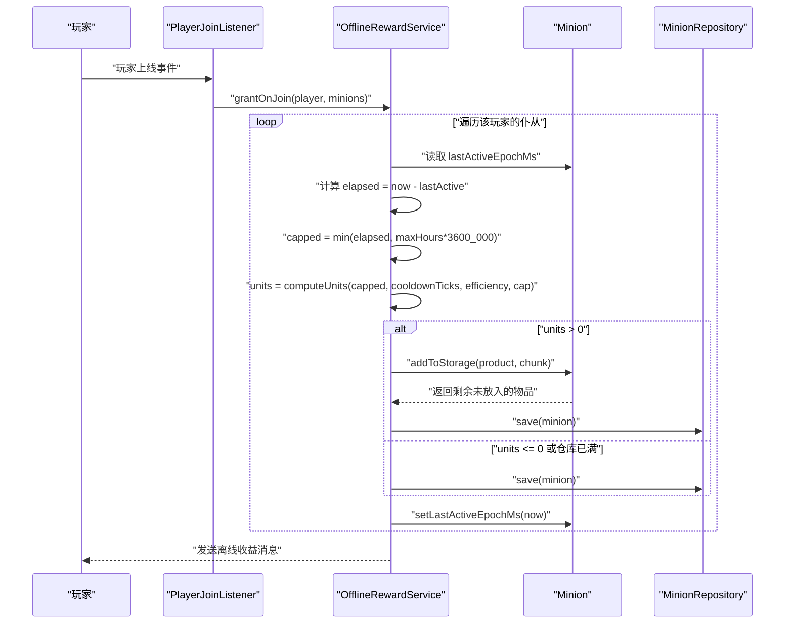
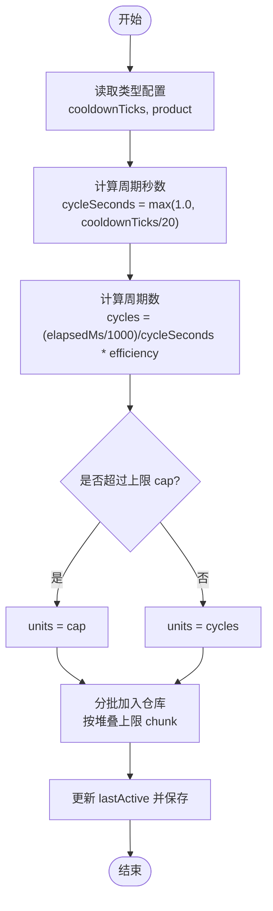
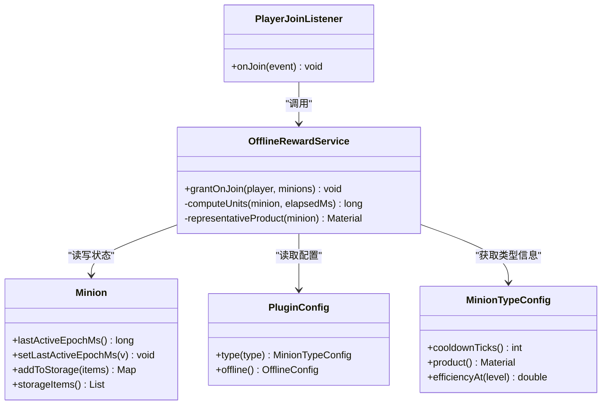

# 离线收益系统

<cite>
**本文引用的文件**
- [OfflineRewardService.java](file://src/main/java/com/hcs/minions/service/OfflineRewardService.java)
- [PlayerJoinListener.java](file://src/main/java/com/hcs/minions/listener/PlayerJoinListener.java)
- [Minion.java](file://src/main/java/com/hcs/minions/model/Minion.java)
- [PluginConfig.java](file://src/main/java/com/hcs/minions/config/PluginConfig.java)
- [OfflineConfig.java](file://src/main/java/com/hcs/minions/config/OfflineConfig.java)
- [MinionTypeConfig.java](file://src/main/java/com/hcs/minions/config/MinionTypeConfig.java)
- [config.yml](file://src/main/resources/config.yml)
- [OfflineRewardServiceTest.java](file://src/test/java/com/hcs/minions/service/OfflineRewardServiceTest.java)
</cite>

## 目录
1. [简介](#简介)
2. [项目结构](#项目结构)
3. [核心组件](#核心组件)
4. [架构总览](#架构总览)
5. [详细组件分析](#详细组件分析)
6. [依赖关系分析](#依赖关系分析)
7. [性能考量](#性能考量)
8. [故障排查指南](#故障排查指南)
9. [结论](#结论)
10. [附录](#附录)

## 简介
本文件面向 SkyMinions 插件的“离线收益系统”，系统性说明离线产出计算与结算机制。内容覆盖：
- 离线时间计算方法：下线时间记录、上线检测、时间差计算
- 产出模拟算法：工作进度估算、产出量计算、效率折扣
- 批量结算优化：最大离线时间限制（48小时）、分批处理、性能优化
- 配置选项：离线收益开关、效率计算公式、结算阈值等
- 计算示例与调试方法
- 常见问题排查与性能优化建议

## 项目结构
离线收益相关代码主要分布在以下位置：
- 服务层：离线收益结算逻辑
- 监听器：玩家上线触发离线收益结算
- 模型：仆从状态、仓库存储、最后活跃时间
- 配置：全局配置根对象与离线配置项
- 资源：配置文件定义离线收益开关、上限、效率倍率等

图表来源
- [PlayerJoinListener.java:26-33](file://src/main/java/com/hcs/minions/listener/PlayerJoinListener.java#L26-L33)
- [OfflineRewardService.java:29-80](file://src/main/java/com/hcs/minions/service/OfflineRewardService.java#L29-L80)
- [Minion.java:682-689](file://src/main/java/com/hcs/minions/model/Minion.java#L682-L689)
- [MinionTypeConfig.java:51-53](file://src/main/java/com/hcs/minions/config/MinionTypeConfig.java#L51-L53)
- [PluginConfig.java:22-45](file://src/main/java/com/hcs/minions/config/PluginConfig.java#L22-L45)

章节来源
- [PlayerJoinListener.java:26-33](file://src/main/java/com/hcs/minions/listener/PlayerJoinListener.java#L26-L33)
- [OfflineRewardService.java:29-80](file://src/main/java/com/hcs/minions/service/OfflineRewardService.java#L29-L80)
- [Minion.java:682-689](file://src/main/java/com/hcs/minions/model/Minion.java#L682-L689)
- [PluginConfig.java:22-45](file://src/main/java/com/hcs/minions/config/PluginConfig.java#L22-L45)
- [config.yml:33-36](file://src/main/resources/config.yml#L33-L36)

## 核心组件
- OfflineRewardService：离线收益结算核心，负责按时间差批量模拟产出并写入真实仓库，更新 lastActive，异步写库，幂等防重复发放。
- PlayerJoinListener：监听玩家上线事件，收集该玩家所有仆从并调用离线收益服务进行一次性结算。
- Minion：维护仆从状态，包括仓库存储、等级、燃料、累计产出、最后活跃时间等；提供 addToStorage 等仓库操作。
- PluginConfig / OfflineConfig / MinionTypeConfig：提供离线收益开关、最大时长、效率倍率、冷却时间、产物类型等配置。
- config.yml：离线收益开关、最大计算时长（48小时）、效率倍率（默认0.5）等。

章节来源
- [OfflineRewardService.java:15-18](file://src/main/java/com/hcs/minions/service/OfflineRewardService.java#L15-L18)
- [PlayerJoinListener.java:13-15](file://src/main/java/com/hcs/minions/listener/PlayerJoinListener.java#L13-L15)
- [Minion.java:67-89](file://src/main/java/com/hcs/minions/model/Minion.java#L67-L89)
- [PluginConfig.java:22-45](file://src/main/java/com/hcs/minions/config/PluginConfig.java#L22-L45)
- [OfflineConfig.java:3-14](file://src/main/java/com/hcs/minions/config/OfflineConfig.java#L3-L14)
- [config.yml:33-36](file://src/main/resources/config.yml#L33-L36)

## 架构总览
离线收益系统在玩家上线时触发，通过一次性批量模拟产出并直接写入仓库，避免逐 tick 回放带来的性能问题。流程如下：
- 玩家上线事件被监听器捕获
- 收集该玩家拥有的所有仆从
- 对每个仆从计算离线时长，应用最大时长限制和效率折扣
- 将模拟产出的物品批量加入仓库，若仓库满则停止继续添加
- 更新 lastActive 并保存数据
- 向玩家发送离线收益消息（包含总产出件数与离线分钟数）

图表来源
- [PlayerJoinListener.java:26-33](file://src/main/java/com/hcs/minions/listener/PlayerJoinListener.java#L26-L33)
- [OfflineRewardService.java:29-80](file://src/main/java/com/hcs/minions/service/OfflineRewardService.java#L29-L80)
- [Minion.java:172-213](file://src/main/java/com/hcs/minions/model/Minion.java#L172-L213)

## 详细组件分析

### 离线时间计算方法
- 下线时间记录：Minion.lastActiveEpochMs 记录上次活跃时间（毫秒），在每次结算后更新为当前时间。
- 上线时间检测：PlayerJoinListener 在玩家上线事件中触发结算。
- 时间差计算：elapsed = now - lastActive；若 lastActive <= 0 视为首次激活，直接设置 lastActive 并保存。
- 最早离线时间用于消息展示：earliestLastActive 用于计算离线分钟数，确保消息准确。

章节来源
- [Minion.java:682-689](file://src/main/java/com/hcs/minions/model/Minion.java#L682-L689)
- [PlayerJoinListener.java:26-33](file://src/main/java/com/hcs/minions/listener/PlayerJoinListener.java#L26-L33)
- [OfflineRewardService.java:38-52](file://src/main/java/com/hcs/minions/service/OfflineRewardService.java#L38-L52)
- [OfflineRewardService.java:76-80](file://src/main/java/com/hcs/minions/service/OfflineRewardService.java#L76-L80)

### 产出模拟算法
- 工作进度估算：基于 cooldownTicks 计算单次工作周期秒数 cycleSeconds = max(1.0, cooldownTicks / 20.0)。
- 产出量计算：cycles = (elapsedMs / 1000.0) / cycleSeconds * efficiency；最终 units = min(cycles, cap)。
- 效率折扣机制：efficiency = minion.efficiency(typeConfig) * offline.rateMultiplier；离线效率受配置倍率影响。
- 产物选择：使用 typeConfig.product 作为代表性产物，按堆叠上限分批加入仓库。

图表来源
- [OfflineRewardService.java:83-94](file://src/main/java/com/hcs/minions/service/OfflineRewardService.java#L83-L94)
- [MinionTypeConfig.java:51-53](file://src/main/java/com/hcs/minions/config/MinionTypeConfig.java#L51-L53)
- [Minion.java:172-213](file://src/main/java/com/hcs/minions/model/Minion.java#L172-L213)

章节来源
- [OfflineRewardService.java:83-94](file://src/main/java/com/hcs/minions/service/OfflineRewardService.java#L83-L94)
- [MinionTypeConfig.java:51-53](file://src/main/java/com/hcs/minions/config/MinionTypeConfig.java#L51-L53)
- [Minion.java:172-213](file://src/main/java/com/hcs/minions/model/Minion.java#L172-L213)

### 批量结算优化
- 最大离线时间限制：maxHours（默认48小时）防止无上限回放，超出部分截断。
- 分批处理：按物品堆叠上限 chunk 分批加入仓库，避免单次过大导致内存压力。
- 性能优化：一次性模拟产出并写入仓库，不逐 tick 回放；结算后立即更新 lastActive 并保存，幂等防重复发放。
- 容量检查：若仓库已满，立即停止继续添加，避免无效循环。

章节来源
- [OfflineRewardService.java:33-35](file://src/main/java/com/hcs/minions/service/OfflineRewardService.java#L33-L35)
- [OfflineRewardService.java:53-73](file://src/main/java/com/hcs/minions/service/OfflineRewardService.java#L53-L73)
- [config.yml:33-36](file://src/main/resources/config.yml#L33-L36)

### 配置选项
- 离线收益开关：offline.enabled
- 最大计算时长：offline.max-hours（默认48小时）
- 效率倍率：offline.rate-multiplier（默认0.5）
- 类型配置：每种仆从的 cooldownTicks、product、sellPricePerUnit 等
- 全局调度参数：tick-period、max-checks-per-cycle、max-minions-per-player

章节来源
- [config.yml:33-36](file://src/main/resources/config.yml#L33-L36)
- [config.yml:47-153](file://src/main/resources/config.yml#L47-L153)
- [PluginConfig.java:22-45](file://src/main/java/com/hcs/minions/config/PluginConfig.java#L22-L45)
- [OfflineConfig.java:3-14](file://src/main/java/com/hcs/minions/config/OfflineConfig.java#L3-L14)

### 计算示例
- 基础场景：离线1小时，cooldown 20 tick（1秒），效率1.0 → 产出3600件
- 超长离线：离线极长，被 cap 截断至100,000件
- 低于一个周期：离线时间不足一个周期，产出0件
- 效率翻倍：效率2.0 → 周期翻倍，产出7200件

章节来源
- [OfflineRewardServiceTest.java:10-31](file://src/test/java/com/hcs/minions/service/OfflineRewardServiceTest.java#L10-L31)

### 调试方法
- 启用 debug 日志：打印仆从工作/搜索详情，便于排查离线收益相关问题
- 检查 lastActive：确认最后活跃时间是否正确更新
- 验证配置：确认 offline.enabled、max-hours、rate-multiplier 是否符合预期
- 单元测试：使用 computeUnits 纯函数测试不同场景下的产出计算

章节来源
- [config.yml:10-11](file://src/main/resources/config.yml#L10-L11)
- [OfflineRewardServiceTest.java:10-31](file://src/test/java/com/hcs/minions/service/OfflineRewardServiceTest.java#L10-L31)

## 依赖关系分析
离线收益系统的依赖关系如下：
- PlayerJoinListener 依赖 OfflineRewardService 和 MinionManager
- OfflineRewardService 依赖 PluginConfig、MinionRepository、Minion、MinionTypeConfig
- Minion 依赖 Bukkit Inventory、ItemStack 等游戏对象
- 配置通过 PluginConfig 统一管理，确保只读共享

图表来源
- [PlayerJoinListener.java:16-33](file://src/main/java/com/hcs/minions/listener/PlayerJoinListener.java#L16-L33)
- [OfflineRewardService.java:19-98](file://src/main/java/com/hcs/minions/service/OfflineRewardService.java#L19-L98)
- [Minion.java:67-89](file://src/main/java/com/hcs/minions/model/Minion.java#L67-L89)
- [PluginConfig.java:22-45](file://src/main/java/com/hcs/minions/config/PluginConfig.java#L22-L45)
- [MinionTypeConfig.java:21-63](file://src/main/java/com/hcs/minions/config/MinionTypeConfig.java#L21-L63)

章节来源
- [PlayerJoinListener.java:16-33](file://src/main/java/com/hcs/minions/listener/PlayerJoinListener.java#L16-L33)
- [OfflineRewardService.java:19-98](file://src/main/java/com/hcs/minions/service/OfflineRewardService.java#L19-L98)
- [Minion.java:67-89](file://src/main/java/com/hcs/minions/model/Minion.java#L67-L89)
- [PluginConfig.java:22-45](file://src/main/java/com/hcs/minions/config/PluginConfig.java#L22-L45)
- [MinionTypeConfig.java:21-63](file://src/main/java/com/hcs/minions/config/MinionTypeConfig.java#L21-L63)

## 性能考量
- 批量结算：一次性模拟产出并写入仓库，避免逐 tick 回放导致的性能问题
- 最大时长限制：防止超长离线导致计算量过大
- 分批处理：按堆叠上限分批加入仓库，减少内存压力
- 容量检查：仓库满时立即停止，避免无效循环
- 配置校验：max-checks-per-cycle 必须小于50，防止单次执行过多方块检查

章节来源
- [OfflineRewardService.java:53-73](file://src/main/java/com/hcs/minions/service/OfflineRewardService.java#L53-L73)
- [PluginConfig.java:36-41](file://src/main/java/com/hcs/minions/config/PluginConfig.java#L36-L41)
- [config.yml:5-7](file://src/main/resources/config.yml#L5-L7)

## 故障排查指南
- 离线收益未生效：检查 offline.enabled 是否为 true
- 产出数量异常：检查 cooldownTicks、efficiency、rate-multiplier 配置
- 仓库满导致产出丢失：确认自动售卖功能或手动收集
- 最后活跃时间未更新：检查 save 操作是否正常执行
- 性能问题：检查 max-hours 是否过大，或服务器 TPS 是否过低

章节来源
- [config.yml:33-36](file://src/main/resources/config.yml#L33-L36)
- [OfflineRewardService.java:72-73](file://src/main/java/com/hcs/minions/service/OfflineRewardService.java#L72-L73)
- [Minion.java:215-223](file://src/main/java/com/hcs/minions/model/Minion.java#L215-L223)

## 结论
SkyMinions 的离线收益系统通过一次性批量模拟产出和结算，有效避免了逐 tick 回放的性能问题。系统提供了灵活的配置选项，支持最大离线时间限制、效率折扣、产物类型等自定义。通过合理的批量处理和容量检查，确保了在高负载环境下的稳定性。建议根据服务器实际情况调整配置参数，以获得最佳性能和用户体验。

## 附录
- 配置参考：config.yml 中的 offline 和 types 部分
- 测试用例：OfflineRewardServiceTest 中的 computeUnits 测试
- 相关文档：插件主 README 和配置说明

章节来源
- [config.yml:33-36](file://src/main/resources/config.yml#L33-L36)
- [config.yml:47-153](file://src/main/resources/config.yml#L47-L153)
- [OfflineRewardServiceTest.java:10-31](file://src/test/java/com/hcs/minions/service/OfflineRewardServiceTest.java#L10-L31)