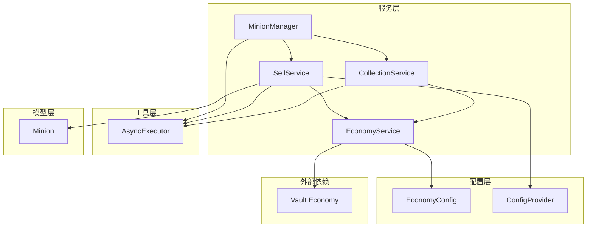
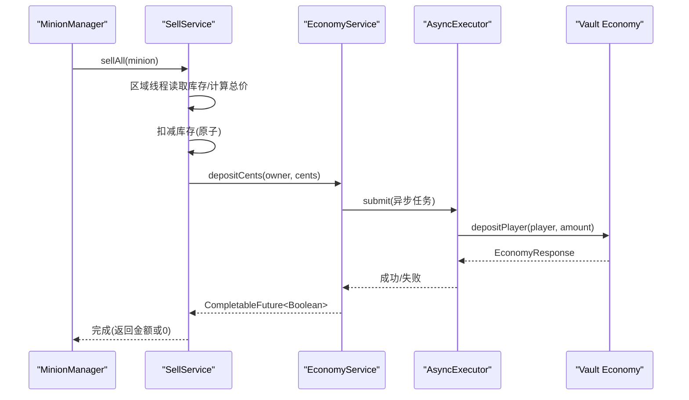
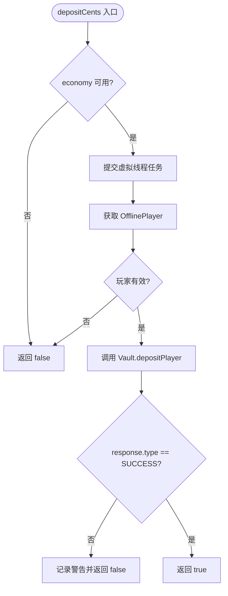
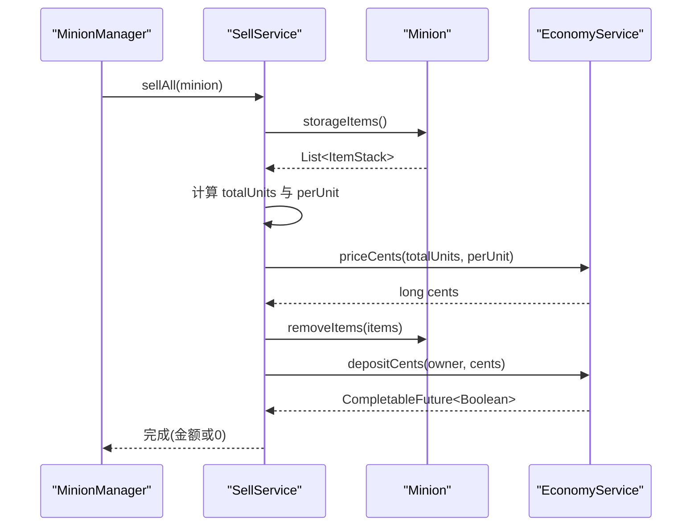
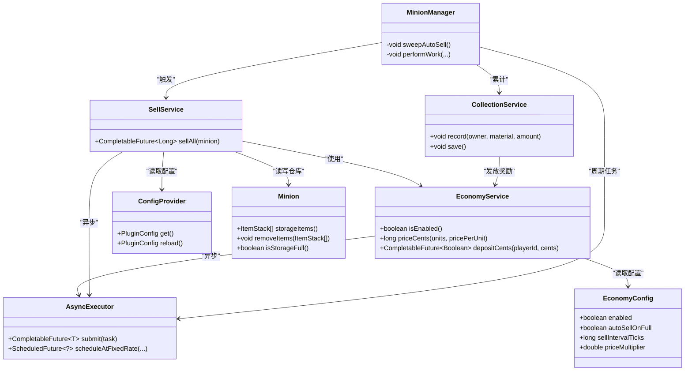

# 经济系统集成

<cite>
**本文引用的文件**
- [EconomyService.java](file://src/main/java/com/hcs/minions/service/EconomyService.java)
- [SellService.java](file://src/main/java/com/hcs/minions/service/SellService.java)
- [MinionManager.java](file://src/main/java/com/hcs/minions/service/MinionManager.java)
- [CollectionService.java](file://src/main/java/com/hcs/minions/service/CollectionService.java)
- [AsyncExecutor.java](file://src/main/java/com/hcs/minions/util/AsyncExecutor.java)
- [ConfigProvider.java](file://src/main/java/com/hcs/minions/config/ConfigProvider.java)
- [EconomyConfig.java](file://src/main/java/com/hcs/minions/config/EconomyConfig.java)
- [config.yml](file://src/main/resources/config.yml)
- [Minion.java](file://src/main/java/com/hcs/minions/model/Minion.java)
</cite>

## 目录
1. [简介](#简介)
2. [项目结构](#项目结构)
3. [核心组件](#核心组件)
4. [架构总览](#架构总览)
5. [详细组件分析](#详细组件分析)
6. [依赖关系分析](#依赖关系分析)
7. [性能考量](#性能考量)
8. [故障排除指南](#故障排除指南)
9. [结论](#结论)
10. [附录](#附录)

## 简介
本文件面向 SkyMinions 插件的经济系统集成，重点说明与 Vault API 的对接方式、EconomyService 对经济操作的封装（余额计算、加款、错误处理）、SellService 的自动售卖机制（仓库满检测、价格计算、批量售卖、交易记录），以及配置项、异步处理策略和常见问题排查。目标是帮助开发者快速理解并安全扩展该经济子系统。

## 项目结构
经济系统相关代码主要分布在 service、config、util 三个层次：
- service：EconomyService（Vault 封装）、SellService（自动售卖编排）、MinionManager（调度与触发）、CollectionService（里程碑奖励）
- config：EconomyConfig（经济开关、倍率、间隔等）、ConfigProvider（运行时配置快照）
- util：AsyncExecutor（虚拟线程异步执行器）
- model：Minion（仓库、GUI、状态）
- resources：config.yml（全局配置，含 economy 段）

图表来源
- [MinionManager.java:101-110](file://src/main/java/com/hcs/minions/service/MinionManager.java#L101-L110)
- [SellService.java:22-32](file://src/main/java/com/hcs/minions/service/SellService.java#L22-L32)
- [EconomyService.java:26-35](file://src/main/java/com/hcs/minions/service/EconomyService.java#L26-L35)
- [CollectionService.java:31-47](file://src/main/java/com/hcs/minions/service/CollectionService.java#L31-L47)
- [AsyncExecutor.java:19-32](file://src/main/java/com/hcs/minions/util/AsyncExecutor.java#L19-L32)
- [ConfigProvider.java:13-33](file://src/main/java/com/hcs/minions/config/ConfigProvider.java#L13-L33)
- [EconomyConfig.java:7-13](file://src/main/java/com/hcs/minions/config/EconomyConfig.java#L7-L13)

章节来源
- [MinionManager.java:101-110](file://src/main/java/com/hcs/minions/service/MinionManager.java#L101-L110)
- [config.yml:23-27](file://src/main/resources/config.yml#L23-L27)

## 核心组件
- EconomyService：负责 Vault 初始化、价格计算（分）、异步加款与错误日志。内部金额统一以“分”为单位，避免浮点误差。
- SellService：实现一键售卖流程——在区域线程读取真实物品、计算总价、先扣物再异步加款，失败时记录日志。
- MinionManager：全局 tick 调度与自动售卖轮询；当满足条件（autoSell 开启或模块支持）且仓库满时触发 SellService。
- CollectionService：资源累计与里程碑奖励，通过 EconomyService 异步发放金币。
- AsyncExecutor：基于 Java 21 虚拟线程的异步执行器，所有 IO（Vault、数据库）均在此执行，避免阻塞主线程。
- ConfigProvider + EconomyConfig：提供不可变配置快照，支持热重载；包含 enabled、auto-sell-on-full、sell-interval-ticks、price-multiplier 等。

章节来源
- [EconomyService.java:17-87](file://src/main/java/com/hcs/minions/service/EconomyService.java#L17-L87)
- [SellService.java:16-81](file://src/main/java/com/hcs/minions/service/SellService.java#L16-L81)
- [MinionManager.java:186-350](file://src/main/java/com/hcs/minions/service/MinionManager.java#L186-L350)
- [CollectionService.java:21-47](file://src/main/java/com/hcs/minions/service/CollectionService.java#L21-L47)
- [AsyncExecutor.java:12-80](file://src/main/java/com/hcs/minions/util/AsyncExecutor.java#L12-L80)
- [ConfigProvider.java:7-33](file://src/main/java/com/hcs/minions/config/ConfigProvider.java#L7-L33)
- [EconomyConfig.java:7-13](file://src/main/java/com/hcs/minions/config/EconomyConfig.java#L7-L13)

## 架构总览
经济系统的调用链如下：
- 工作产出后，MinionManager 将掉落物加入仓库，若满足自动售卖条件且仓库已满，则调用 SellService.sellAll。
- SellService 在区域线程读取真实物品并计算总价，先扣减库存，再通过 EconomyService 异步加款。
- EconomyService 使用 AsyncExecutor 在虚拟线程中调用 Vault API，校验返回结果并记录日志。
- CollectionService 在每次产出时累计资源，并在达到里程碑时通过 EconomyService 异步发放金币。

图表来源
- [MinionManager.java:318-320](file://src/main/java/com/hcs/minions/service/MinionManager.java#L318-L320)
- [SellService.java:41-79](file://src/main/java/com/hcs/minions/service/SellService.java#L41-L79)
- [EconomyService.java:69-86](file://src/main/java/com/hcs/minions/service/EconomyService.java#L69-L86)
- [AsyncExecutor.java:34-44](file://src/main/java/com/hcs/minions/util/AsyncExecutor.java#L34-L44)

## 详细组件分析

### EconomyService：经济操作封装
- 功能要点
  - 初始化：检查配置与 Vault 是否启用，获取 Economy 实例。
  - 价格计算：units × pricePerUnit × priceMultiplier × 100，使用 BigDecimal 避免浮点误差，返回“分”。
  - 异步加款：depositCents 在虚拟线程中执行，校验 response.type == SUCCESS，否则记录警告日志并返回失败。
  - 可用性：isEnabled() 用于上层判断是否启用经济功能。
- 复杂度与边界
  - 时间复杂度：O(1) 计算；Vault 调用为 I/O 耗时，由异步执行器承担。
  - 边界处理：cents <= 0 直接返回 false；玩家离线无法取到名称时返回 false。
- 错误处理
  - 未找到 Vault 或 Economy 实现时关闭经济功能并记录警告。
  - Vault 返回非 SUCCESS 时记录警告，不结算、不清空背包。

图表来源
- [EconomyService.java:38-49](file://src/main/java/com/hcs/minions/service/EconomyService.java#L38-L49)
- [EconomyService.java:58-86](file://src/main/java/com/hcs/minions/service/EconomyService.java#L58-L86)

章节来源
- [EconomyService.java:17-87](file://src/main/java/com/hcs/minions/service/EconomyService.java#L17-L87)

### SellService：自动售卖机制
- 功能要点
  - 一键售卖：sellAll 在区域线程读取解锁存储槽的真实物品，汇总数量，按类型单价与全局倍率计算总价。
  - 先扣物后加款：确保不会出现“先加款后扣物”导致的刷钱窗口问题。
  - 异步加款：成功后返回金额，失败记录错误日志（物品已扣除需人工核查）。
  - 仅扣减解锁槽位：不误删按钮、燃料槽、锁定占位槽。
- 触发时机
  - MinionManager 在工作完成后检查 shouldAutoSell 且 isStorageFull 时触发。
  - 另有 GlobalRegionScheduler 定时轮询 sweepAutoSell，周期性检查并售卖。
- 数据流
  - storageItems() 只收集可售卖物品；removeItems(items) 精确匹配并扣减；economy.priceCents 计算总价；economy.depositCents 异步加款。

图表来源
- [SellService.java:41-79](file://src/main/java/com/hcs/minions/service/SellService.java#L41-L79)
- [Minion.java:150-159](file://src/main/java/com/hcs/minions/model/Minion.java#L150-L159)
- [Minion.java:252-274](file://src/main/java/com/hcs/minions/model/Minion.java#L252-L274)
- [EconomyService.java:58-86](file://src/main/java/com/hcs/minions/service/EconomyService.java#L58-L86)

章节来源
- [SellService.java:16-81](file://src/main/java/com/hcs/minions/service/SellService.java#L16-L81)
- [MinionManager.java:318-350](file://src/main/java/com/hcs/minions/service/MinionManager.java#L318-L350)
- [Minion.java:215-223](file://src/main/java/com/hcs/minions/model/Minion.java#L215-L223)

### MinionManager：调度与触发
- 全局 tick：遍历所有仆从，检查区块加载、生成实体、燃料衰减、工作执行。
- 自动售卖：shouldAutoSell 判断（autoSell 开关或模块支持）+ isStorageFull 检测，调用 sell.sellAll。
- 轮询：GlobalRegionScheduler 定期 sweepAutoSell，避免在主线程频繁扫描造成卡顿。
- 落库：snapshotAndFlush 在区域线程生成快照并批量落库，避免并发写入不一致。

章节来源
- [MinionManager.java:186-350](file://src/main/java/com/hcs/minions/service/MinionManager.java#L186-L350)

### CollectionService：里程碑与经济奖励
- 资源累计：record 线程安全合并累计量，检测阈值并触发 award。
- 里程碑奖励：通过 EconomyService 异步发放金币，在线玩家发送消息提示。
- 持久化：save 将 totals 与 claimed 写入 collection.yml。

章节来源
- [CollectionService.java:121-162](file://src/main/java/com/hcs/minions/service/CollectionService.java#L121-L162)
- [CollectionService.java:218-238](file://src/main/java/com/hcs/minions/service/CollectionService.java#L218-L238)

### 配置选项
- economy.enabled：是否启用经济功能（需要 Vault）。
- economy.auto-sell-on-full：仓库满时自动售卖（也可通过模块触发）。
- economy.sell-interval-ticks：自动售卖轮询间隔。
- economy.price-multiplier：全局价格倍率。
- types.*.sell-price-per-unit：各类型单位售价。

章节来源
- [config.yml:23-27](file://src/main/resources/config.yml#L23-L27)
- [config.yml:47-153](file://src/main/resources/config.yml#L47-L153)
- [EconomyConfig.java:7-13](file://src/main/java/com/hcs/minions/config/EconomyConfig.java#L7-L13)

## 依赖关系分析
- EconomyService 依赖：
  - Vault Economy（可选，未启用则关闭经济功能）
  - AsyncExecutor（异步执行）
  - EconomyConfig（配置）
- SellService 依赖：
  - EconomyService（计价与加款）
  - ConfigProvider（类型单价）
  - Minion（仓库读写）
  - AsyncExecutor（异步加款）
- MinionManager 依赖：
  - SellService（触发售卖）
  - CollectionService（累计与里程碑）
  - AsyncExecutor（周期任务）
- CollectionService 依赖：
  - EconomyService（里程碑金币）
  - 文件系统（collection.yml）

图表来源
- [EconomyService.java:26-86](file://src/main/java/com/hcs/minions/service/EconomyService.java#L26-L86)
- [SellService.java:22-79](file://src/main/java/com/hcs/minions/service/SellService.java#L22-L79)
- [MinionManager.java:186-350](file://src/main/java/com/hcs/minions/service/MinionManager.java#L186-L350)
- [CollectionService.java:31-162](file://src/main/java/com/hcs/minions/service/CollectionService.java#L31-L162)
- [AsyncExecutor.java:19-80](file://src/main/java/com/hcs/minions/util/AsyncExecutor.java#L19-L80)
- [ConfigProvider.java:13-33](file://src/main/java/com/hcs/minions/config/ConfigProvider.java#L13-L33)
- [EconomyConfig.java:7-13](file://src/main/java/com/hcs/minions/config/EconomyConfig.java#L7-L13)
- [Minion.java:150-274](file://src/main/java/com/hcs/minions/model/Minion.java#L150-L274)

## 性能考量
- 异步隔离：所有 Vault 调用与 IO 通过 AsyncExecutor 在虚拟线程执行，避免阻塞主线程与区域线程。
- 区域线程安全：Inventory 访问严格限制在区域线程（Bukkit.getRegionScheduler），防止并发修改导致不一致。
- 批量落库：snapshotAndFlush 收集多个快照后批量写入，减少磁盘 I/O 次数。
- 轮询优化：自动售卖使用 GlobalRegionScheduler 固定频率轮询，避免高频扫描。
- 精度控制：价格计算使用 BigDecimal，仅在 Vault 边界转换为 double，避免浮点误差累积。

[本节为通用性能指导，无需特定文件引用]

## 故障排除指南
- Vault 未启用或未找到实现
  - 现象：经济功能关闭，售卖与里程碑奖励无效。
  - 排查：检查 config.yml 中 economy.enabled 与服务器是否安装并启用 Vault。
  - 参考：EconomyService.setupEconomy 日志输出。
- 加款失败
  - 现象：日志出现“Vault 加款失败”，玩家账户未增加。
  - 排查：确认玩家 UUID 有效、Vault 响应类型为 SUCCESS；检查网络与 Vault 插件状态。
  - 参考：EconomyService.depositCents 错误分支。
- 自动售卖未触发
  - 现象：仓库满但未售卖。
  - 排查：确认 minion.autoSell 或模块支持；检查 sell-interval-ticks 设置；查看 MinionManager.sweepAutoSell 是否运行。
  - 参考：MinionManager.shouldAutoSell 与 sweepAutoSell。
- 刷钱漏洞修复
  - 现象：旧实现“先加款后扣物”可能导致多卖钱未扣物。
  - 解决：当前实现“先扣物后加款”，确保一致性；如仍异常，检查 SellService.removeItems 与 depositCents 顺序。
  - 参考：SellService.sellAll 注释与实现。
- 配置热重载
  - 现象：运行时调整价格倍率或售卖间隔。
  - 方法：使用 /minion reload 更新 ConfigProvider 快照，无需重启。
  - 参考：ConfigProvider.reload。

章节来源
- [EconomyService.java:38-49](file://src/main/java/com/hcs/minions/service/EconomyService.java#L38-L49)
- [EconomyService.java:69-86](file://src/main/java/com/hcs/minions/service/EconomyService.java#L69-L86)
- [SellService.java:34-79](file://src/main/java/com/hcs/minions/service/SellService.java#L34-L79)
- [MinionManager.java:324-350](file://src/main/java/com/hcs/minions/service/MinionManager.java#L324-L350)
- [ConfigProvider.java:27-33](file://src/main/java/com/hcs/minions/config/ConfigProvider.java#L27-L33)

## 结论
SkyMinions 的经济系统集成通过 EconomyService 与 SellService 实现了安全、高效、可扩展的 Vault 对接。关键设计包括：
- 金额以“分”为单位，避免浮点误差。
- 先扣物后加款，杜绝刷钱窗口。
- 全链路异步化，避免阻塞主线程。
- 区域线程安全访问 Inventory，保证数据一致性。
- 配置热重载，便于动态调优。
建议在生产环境监控 Vault 响应与日志，合理设置价格倍率与售卖间隔，并结合 Collection 里程碑提升玩家体验。

[本节为总结性内容，无需特定文件引用]

## 附录
- 最佳实践
  - 始终通过 EconomyService.isEnabled() 判断经济功能可用性。
  - 对所有 Vault 调用进行返回值校验，记录失败日志。
  - 使用 AsyncExecutor 执行所有 IO 任务，避免阻塞。
  - 在区域线程内操作 Inventory，禁止跨线程访问。
  - 使用 ConfigProvider 读取配置，避免 getConfig() 散落业务逻辑。
- 性能优化
  - 合理设置 sell-interval-ticks，平衡实时性与性能。
  - 使用 BigDecimal 计算价格，仅在 Vault 边界转换。
  - 批量落库减少磁盘 I/O。
  - 利用 GlobalRegionScheduler 进行轮询，避免主线程压力。

[本节为通用指导，无需特定文件引用]