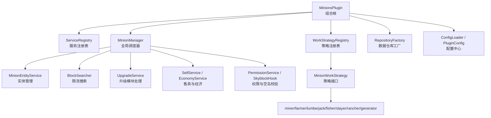
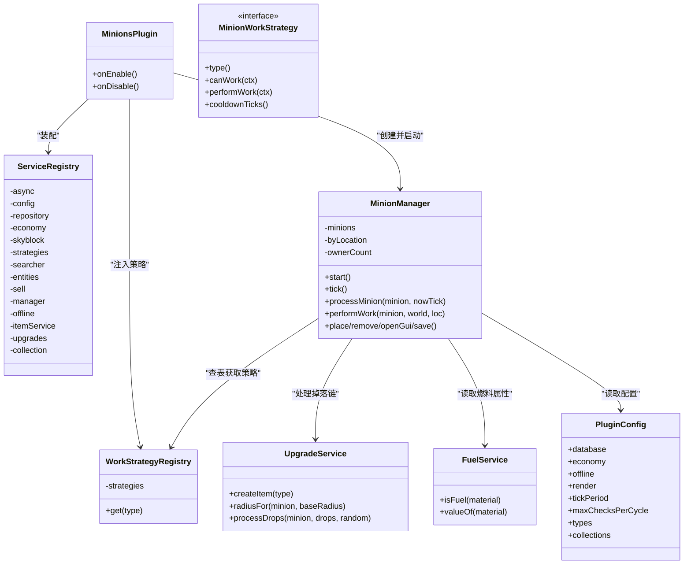
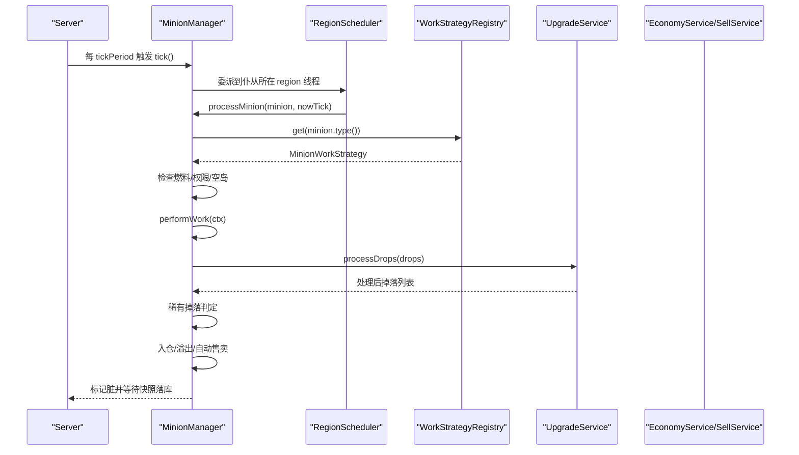
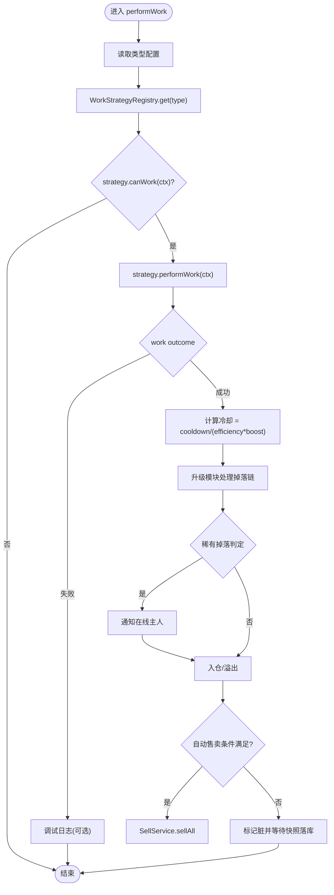
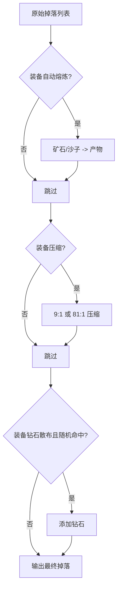
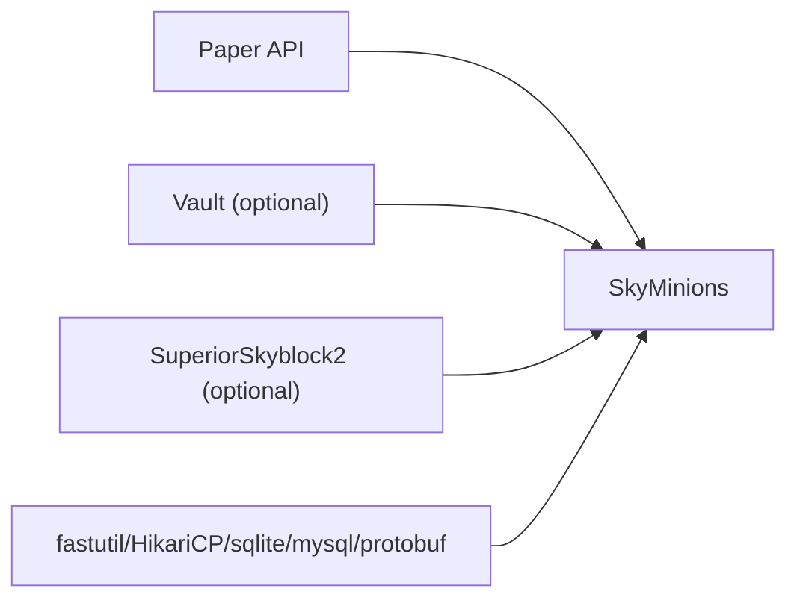

# 项目概述

<cite>
**本文引用的文件**
- [MinionsPlugin.java](file://src/main/java/com/hcs/minions/MinionsPlugin.java)
- [ServiceRegistry.java](file://src/main/java/com/hcs/minions/core/ServiceRegistry.java)
- [MinionManager.java](file://src/main/java/com/hcs/minions/service/MinionManager.java)
- [WorkStrategyRegistry.java](file://src/main/java/com/hcs/minions/work/WorkStrategyRegistry.java)
- [MinionWorkStrategy.java](file://src/main/java/com/hcs/minions/work/MinionWorkStrategy.java)
- [FuelService.java](file://src/main/java/com/hcs/minions/service/FuelService.java)
- [UpgradeService.java](file://src/main/java/com/hcs/minions/upgrade/UpgradeService.java)
- [PluginConfig.java](file://src/main/java/com/hcs/minions/config/PluginConfig.java)
- [MinionType.java](file://src/main/java/com/hcs/minions/model/MinionType.java)
- [README.md](file://README.md)
- [pom.xml](file://pom.xml)
- [paper-plugin.yml](file://src/main/resources/paper-plugin.yml)
</cite>

## 目录
1. [简介](#简介)
2. [项目结构](#项目结构)
3. [核心组件](#核心组件)
4. [架构总览](#架构总览)
5. [详细组件分析](#详细组件分析)
6. [依赖关系分析](#依赖关系分析)
7. [性能考量](#性能考量)
8. [故障排查指南](#故障排查指南)
9. [结论](#结论)
10. [附录：快速开始](#附录快速开始)

## 简介
SkyMinions 是一款基于 Paper 1.21+ 的 Minecraft 服务器插件，提供 Hypixel 风格的硬核生存仆从系统。玩家放置“盔甲架小人”后，它会在固定范围内自动采集、生产与加工，支持升级系统、燃料加速、离线收益、自动售卖、稀有掉落、Collection 里程碑奖励以及与 SuperiorSkyblock2、LuckPerms、Vault 等生态联动。插件采用分层架构与服务注册表模式，通过策略模式将七种仆从类型（矿工、农夫、伐木工、钓鱼、猎魔、牧民、圆石生成器）的工作逻辑解耦，便于扩展与维护。

## 项目结构
插件以 Maven 构建，主类为 MinionsPlugin，负责生命周期管理与服务装配；核心业务按包划分：
- core：服务注册表 ServiceRegistry
- config：强类型配置（record），启动时加载并全局只读共享
- model：领域模型（Minion、MinionType、BlockLocation 等）
- repository：数据持久化接口与实现（SQLite/MySQL + 内存缓存）
- service：服务层（MinionManager、EconomyService、FuelService、SellService、PermissionService、OfflineRewardService 等）
- work：策略模式工作单元（各类型策略 + WorkStrategyRegistry）
- gui/listener/event：交互、事件与 GUI 监听
- upgrade：升级模块处理（熔炼/压缩/散布/范围扩展）
- util：异步执行器、日志、消息等工具

图表来源
- [MinionsPlugin.java:51-118](file://src/main/java/com/hcs/minions/MinionsPlugin.java#L51-L118)
- [ServiceRegistry.java:18-149](file://src/main/java/com/hcs/minions/core/ServiceRegistry.java#L18-L149)
- [MinionManager.java:44-86](file://src/main/java/com/hcs/minions/service/MinionManager.java#L44-L86)
- [WorkStrategyRegistry.java:10-33](file://src/main/java/com/hcs/minions/work/WorkStrategyRegistry.java#L10-L33)

章节来源
- [README.md:1-109](file://README.md#L1-L109)
- [pom.xml:1-132](file://pom.xml#L1-L132)
- [paper-plugin.yml:1-47](file://src/main/resources/paper-plugin.yml#L1-L47)

## 核心组件
- 服务注册表（ServiceRegistry）：组合根，集中持有所有服务实例，提供只读访问，避免散落的静态单例。
- 全局调度器（MinionManager）：使用 GlobalRegionScheduler 每 tickPeriod 遍历在线区域仆从，委派到各自 region 线程执行工作，保证线程安全与 Folia 兼容。
- 策略注册表（WorkStrategyRegistry）：维护 MinionType -> MinionWorkStrategy 映射，新增类型无需修改调度逻辑。
- 配置中心（PluginConfig）：强类型 record，启动时一次性加载，运行时不可变，禁止业务代码直接读取动态配置。
- 升级模块（UpgradeService）：处理自动熔炼、自动压缩、超级压缩、钻石散布与范围扩展，严格遵循 Hypixel 原版顺序与比例。
- 燃料系统（FuelService）：定义限时与永久燃料及其速度加成，无燃料仍可工作但速度降低。
- 数据仓库（Repository）：抽象存储接口，支持 SQLite/MySQL 与内存缓存，提供脏标记快照落库。

章节来源
- [ServiceRegistry.java:18-149](file://src/main/java/com/hcs/minions/core/ServiceRegistry.java#L18-L149)
- [MinionManager.java:44-115](file://src/main/java/com/hcs/minions/service/MinionManager.java#L44-L115)
- [WorkStrategyRegistry.java:10-33](file://src/main/java/com/hcs/minions/work/WorkStrategyRegistry.java#L10-L33)
- [PluginConfig.java:8-46](file://src/main/java/com/hcs/minions/config/PluginConfig.java#L8-L46)
- [UpgradeService.java:19-107](file://src/main/java/com/hcs/minions/upgrade/UpgradeService.java#L19-L107)
- [FuelService.java:7-53](file://src/main/java/com/hcs/minions/service/FuelService.java#L7-L53)

## 架构总览
插件采用分层架构与清晰职责分离：
- 表现层：GUI 监听与命令入口，用户交互与可视化
- 服务层：MinionManager 编排工作流，调用策略、升级、经济、权限、空岛等能力
- 领域层：Minion、MinionType、WorkContext、WorkOutcome 等核心模型
- 基础设施层：Repository、AsyncExecutor、日志、消息、配置加载

图表来源
- [MinionsPlugin.java:51-118](file://src/main/java/com/hcs/minions/MinionsPlugin.java#L51-L118)
- [ServiceRegistry.java:18-149](file://src/main/java/com/hcs/minions/core/ServiceRegistry.java#L18-L149)
- [MinionManager.java:44-115](file://src/main/java/com/hcs/minions/service/MinionManager.java#L44-L115)
- [WorkStrategyRegistry.java:10-33](file://src/main/java/com/hcs/minions/work/WorkStrategyRegistry.java#L10-L33)
- [MinionWorkStrategy.java:5-26](file://src/main/java/com/hcs/minions/work/MinionWorkStrategy.java#L5-L26)
- [UpgradeService.java:19-107](file://src/main/java/com/hcs/minions/upgrade/UpgradeService.java#L19-L107)
- [FuelService.java:7-53](file://src/main/java/com/hcs/minions/service/FuelService.java#L7-L53)
- [PluginConfig.java:8-46](file://src/main/java/com/hcs/minions/config/PluginConfig.java#L8-L46)

## 详细组件分析

### 服务注册表与组合根
- 作用：在 onEnable 中按依赖顺序装配所有服务，之后全局只读共享，避免循环依赖与重复初始化。
- 关键点：
  - 配置加载与提供：ConfigLoader -> PluginConfig -> ConfigProvider
  - 策略注册：根据配置枚举 MinionType 动态注册 Miner/Farmer/Lumberjack/Fisher/Slayer/Rancher/Generator
  - 任务调度：GlobalRegionScheduler 启动 tick 与自动售卖轮询
  - 资源清理：onDisable 停止调度、保存 Collection、关闭仓库与异步执行器

章节来源
- [MinionsPlugin.java:51-118](file://src/main/java/com/hcs/minions/MinionsPlugin.java#L51-L118)
- [ServiceRegistry.java:18-149](file://src/main/java/com/hcs/minions/core/ServiceRegistry.java#L18-L149)

### 全局调度与工作编排（MinionManager）
- 关键路径：
  - start()：加载仓库数据，注册 GlobalRegionScheduler 定时任务，启动快照落库与自动售卖轮询
  - tick()：仅做纯内存与线程安全的只读判断（区块是否加载、坐标转换），真正触碰方块/实体的操作委派到 RegionScheduler
  - processMinion()：按需生成盔甲架、燃料衰减、权限与空岛校验、调用 performWork
  - performWork()：查询策略、执行工作、计算冷却、处理掉落链（升级模块）、稀有掉落、入仓与溢出、自动售卖
- 线程安全：Inventory 操作均在 region 线程；快照落库在对应 region 线程认领脏标记并序列化，避免并发不一致

图表来源
- [MinionManager.java:92-115](file://src/main/java/com/hcs/minions/service/MinionManager.java#L92-L115)
- [MinionManager.java:191-250](file://src/main/java/com/hcs/minions/service/MinionManager.java#L191-L250)
- [MinionManager.java:252-322](file://src/main/java/com/hcs/minions/service/MinionManager.java#L252-L322)
- [UpgradeService.java:170-188](file://src/main/java/com/hcs/minions/upgrade/UpgradeService.java#L170-L188)

章节来源
- [MinionManager.java:92-322](file://src/main/java/com/hcs/minions/service/MinionManager.java#L92-L322)

### 策略模式与工作类型
- 接口设计：MinionWorkStrategy 暴露 type()/canWork()/performWork()/cooldownTicks()
- 注册机制：WorkStrategyRegistry 使用 EnumMap 维护类型到策略的映射，新增类型只需注册新策略，符合开闭原则
- 七种类型：MINER、FARMER、LUMBERJACK、FISHER、SLAYER、RANCHER、COBBLE，分别对应不同工作语义与产出

图表来源
- [MinionManager.java:252-322](file://src/main/java/com/hcs/minions/service/MinionManager.java#L252-L322)
- [WorkStrategyRegistry.java:10-33](file://src/main/java/com/hcs/minions/work/WorkStrategyRegistry.java#L10-L33)
- [MinionWorkStrategy.java:5-26](file://src/main/java/com/hcs/minions/work/MinionWorkStrategy.java#L5-L26)

章节来源
- [MinionWorkStrategy.java:5-26](file://src/main/java/com/hcs/minions/work/MinionWorkStrategy.java#L5-L26)
- [WorkStrategyRegistry.java:10-33](file://src/main/java/com/hcs/minions/work/WorkStrategyRegistry.java#L10-L33)
- [MinionType.java:8-52](file://src/main/java/com/hcs/minions/model/MinionType.java#L8-L52)

### 升级系统与掉落处理链
- 模块效果顺序：自动熔炼 -> 自动压缩 -> 超级压缩 -> 钻石散布
- 范围扩展：面积放大 5%，反推半径并保持奇数边长对称
- 压缩比例：普通压缩 9:1，超级压缩 81:1（模拟附魔形态占位）
- 掉落物不修改原对象，返回全新列表，避免引用泄漏

图表来源
- [UpgradeService.java:170-188](file://src/main/java/com/hcs/minions/upgrade/UpgradeService.java#L170-L188)
- [UpgradeService.java:147-163](file://src/main/java/com/hcs/minions/upgrade/UpgradeService.java#L147-L163)
- [UpgradeService.java:199-232](file://src/main/java/com/hcs/minions/upgrade/UpgradeService.java#L199-L232)

章节来源
- [UpgradeService.java:19-107](file://src/main/java/com/hcs/minions/upgrade/UpgradeService.java#L19-L107)
- [UpgradeService.java:147-232](file://src/main/java/com/hcs/minions/upgrade/UpgradeService.java#L147-L232)

### 燃料系统与速度加成
- 燃料分类：限时燃料（煤炭、岩浆桶等）提供加速并在时间耗尽后移除；永久燃料（岩浆膏、荧石粉、日光传感器）持续加速不衰减
- 无燃料仍可工作，仅速度降低；燃料衰减由 MinionManager 每 tick 周期处理

章节来源
- [FuelService.java:7-53](file://src/main/java/com/hcs/minions/service/FuelService.java#L7-L53)
- [MinionManager.java:237-244](file://src/main/java/com/hcs/minions/service/MinionManager.java#L237-L244)

### 配置与权限
- 配置：PluginConfig 为不可变快照，包含数据库、经济、离线收益、渲染、调度周期、最大检查次数、每种类型配置、Collection 里程碑等
- 权限：LuckPerms 接管 Bukkit 权限，控制类型可用性与数量上限；上限可与 Collection 里程碑槽位加成叠加

章节来源
- [PluginConfig.java:8-46](file://src/main/java/com/hcs/minions/config/PluginConfig.java#L8-L46)
- [paper-plugin.yml:24-47](file://src/main/resources/paper-plugin.yml#L24-L47)
- [README.md:49-66](file://README.md#L49-L66)

## 依赖关系分析
- 平台 API：Paper API（provided），确保与 1.21+ 兼容
- 可选依赖：Vault（经济）、SuperiorSkyblock2（空岛），缺失时插件仍可运行但相应能力关闭
- 运行时依赖：fastutil、HikariCP、sqlite-jdbc、mysql-connector-j、protobuf-java，通过 paper-plugin.yml 的 libraries 自动下载
- 设计解耦：通过 ServiceRegistry 与接口抽象，降低耦合度，便于替换实现与测试

图表来源
- [pom.xml:40-111](file://pom.xml#L40-L111)
- [paper-plugin.yml:8-22](file://src/main/resources/paper-plugin.yml#L8-L22)

章节来源
- [pom.xml:40-111](file://pom.xml#L40-L111)
- [paper-plugin.yml:8-22](file://src/main/resources/paper-plugin.yml#L8-L22)

## 性能考量
- 全局单调度器：每 tickPeriod 遍历一次，O(n)+O(1) 短路，减少无效计算
- 限流搜索：BlockSearcher 单次策略执行硬上限 <50，避免卡顿
- 线程安全：Inventory 操作在主线程/region 线程；Vault 售卖异步；快照落库在对应 region 线程认领脏标记并批量写入
- 区块加载：仅在需要时异步加载区块，未加载则跳过
- 自动售卖：改为 GlobalRegionScheduler 轮询，避免跨线程访问 Inventory

章节来源
- [README.md:82-84](file://README.md#L82-L84)
- [MinionManager.java:191-215](file://src/main/java/com/hcs/minions/service/MinionManager.java#L191-L215)
- [MinionManager.java:333-350](file://src/main/java/com/hcs/minions/service/MinionManager.java#L333-L350)
- [PluginConfig.java:36-41](file://src/main/java/com/hcs/minions/config/PluginConfig.java#L36-L41)

## 故障排查指南
- 常见问题定位：
  - 未找到目标 anchor：开启 debug，查看调试日志中的位置与半径信息
  - 异常工作：捕获异常并记录 minion id 与类型，便于复现
  - 孤儿实体：重载后残留盔甲架会被清理（purgeOrphans）
  - 快照不一致：已在 snapshotAndFlush 中修复，确保 Inventory 访问在 region 线程
- 建议步骤：
  - 检查权限与空岛校验是否允许工作
  - 确认燃料是否充足（影响速度但不阻止工作）
  - 查看升级模块是否正确装备与生效
  - 观察自动售卖开关与模块是否启用

章节来源
- [MinionManager.java:266-280](file://src/main/java/com/hcs/minions/service/MinionManager.java#L266-L280)
- [MinionManager.java:397-413](file://src/main/java/com/hcs/minions/service/MinionManager.java#L397-L413)
- [MinionManager.java:117-160](file://src/main/java/com/hcs/minions/service/MinionManager.java#L117-L160)

## 结论
SkyMinions 通过服务注册表与策略模式实现了高内聚、低耦合的分层架构，结合 GlobalRegionScheduler 与 RegionScheduler 保证了线程安全与 Folia 兼容性。插件完整还原了 Hypixel 风格的核心机制（固定工作范围、模块槽位解锁、永久燃料、超级压缩、Collection 里程碑等），并提供离线收益、自动售卖、稀有掉落与生态联动能力。其清晰的包结构与强类型配置使得扩展与维护成本较低，适合大规模服务器部署。

## 附录：快速开始
- 安装：将构建产物放入服务器 plugins 目录，确保已安装 Paper 1.21+ 及可选依赖 Vault、SuperiorSkyblock2、LuckPerms
- 发放仆从：使用命令发放生成物（如 miner/farmer/lumberjack/fisher/slayer/rancher/cobble）
- 放置与交互：右键方块放置生成盔甲架小人；右键小人打开真实仓库（取放物品、燃料、升级、模块、皮肤、拾取）
- 升级与模块：使用命令发放模块，手持点击模块槽装备；支持自动熔炼、自动压缩、超级压缩、钻石散布、范围扩展、自动售卖漏斗
- 查看进度：使用命令查看资源累计与下一里程碑进度（含已解锁的里程碑槽位加成）
- 权限：通过 LuckPerms 分配 hcs.minions.* 权限控制类型与数量上限

章节来源
- [README.md:37-66](file://README.md#L37-L66)
- [paper-plugin.yml:24-47](file://src/main/resources/paper-plugin.yml#L24-L47)